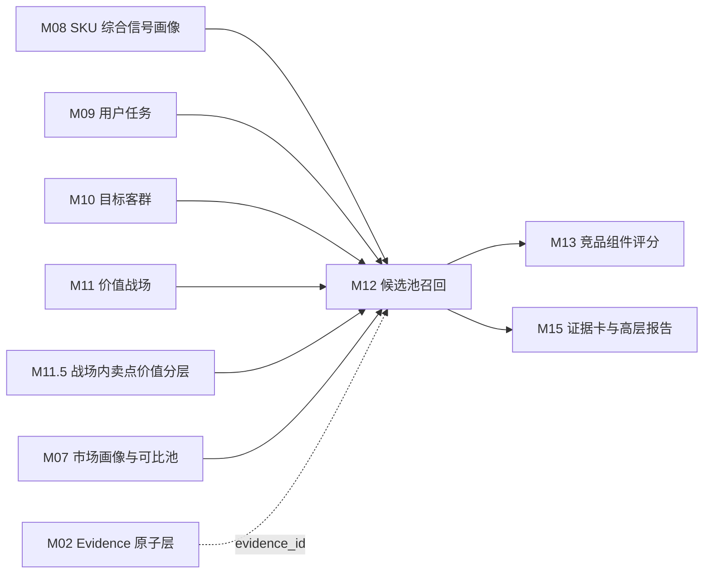

# M12 候选池召回模块 SOP 需求

## 0. 单模块强化状态

本文件已按“单模块逐一强化”要求完成第一轮强化。下一步应处理 M13 竞品组件评分模块。

## 1. 模块目标

M12 围绕目标 SKU 生成可解释的竞品候选池。M12 的目标不是直接判断“谁是核心竞品”，也不是输出排序榜单，而是在 M09-M11.5 已经形成的任务、客群、价值战场和战场内卖点价值基础上，把所有具备业务竞争可能性的候选 SKU 找出来，并说明每个候选为什么进入候选池。

M12 要回答六个问题：

1. 哪些 SKU 与目标 SKU 处在同一个或相邻的竞争语境中？
2. 候选是因为正面对打、价格/销量压力、配置拦截、升级替代、降级替代还是场景替代进入池？
3. 候选与目标 SKU 在价值战场、用户任务、目标客群、卖点价值、价格、尺寸、渠道和市场表现上有哪些重合或差异？
4. 召回证据是否来自真实上游结果，并可追溯到 evidence？
5. 候选池规模是否适合交给 M13 做组件评分？
6. 哪些候选只是弱召回，需要 M13/M14 谨慎处理或 M16 复核？

当前 205 样例数据全部为海信品牌，因此 M12 不能把“竞品”理解为“外部品牌”。同品牌内部 SKU 可以形成正面对打、价格拦截、升级替代、降级替代和场景替代关系。

## 2. 设计依据

本模块依据：

- `cankao/CatForge_竞品生成SOP_详细指导_v1.md` 的 M12 要求。
- `cankao/catforge_sop_md/modules/M12_候选池召回模块.md`。
- `cankao/CatForge_核心竞品展示页_UI设计规范_v1.md` 中“候选池召回”和七步推导展示要求。
- M08 已强化后的 SKU 综合信号画像和下游特征边界。
- M09 已强化后的用户任务结果。
- M10 已强化后的目标客群结果。
- M11 已强化后的价值战场结果。
- M11.5 已强化后的战场内卖点价值分层。
- M07 已强化后的市场画像和可比池基线。
- [00 真实样例数据基线](00_real_data_baseline.md)。
- 数据分层原则：M12 默认消费上游产物，不直接读取原始表做业务判断。

## 3. 上游输入

### 3.1 必须输入

| 输入 | 来源 | 用途 |
| --- | --- | --- |
| `core3_clean_sku` | M01 | 候选 SKU 主数据和品类边界 |
| `core3_sku_signal_profile` | M08 | 目标 SKU 和候选 SKU 的统一画像 |
| `core3_sku_downstream_feature_view` | M08 | `for_module=M12` 的候选召回特征视图 |
| `core3_sku_signal_evidence_matrix` | M08 | 判断目标与候选证据覆盖 |
| `core3_sku_market_profile` | M07，经 M08 汇总 | 价格、销量、销额、平台、趋势 |
| `core3_comparable_pool_baseline` | M07，经 M08 汇总 | 同尺寸、同价位、相邻尺寸和平台可比池 |
| `core3_sku_task_score` | M09 | 目标与候选的用户任务匹配 |
| `core3_sku_target_group_score` | M10 | 目标与候选的客群匹配 |
| `core3_sku_battlefield_score` | M11 | 目标与候选的战场匹配 |
| `core3_sku_battlefield_portfolio` | M11 | 主/次/机会/弱战场组合 |
| `core3_sku_claim_value_layer` | M11.5 | 战场内卖点价值层级匹配 |
| `core3_sku_battlefield_claim_value_summary` | M11.5 | 战场内卖点组合摘要 |
| `core3_evidence_atom` | M02 | evidence 回溯 |

### 3.2 从 M08 消费的基础特征

| 特征域 | 用途 |
| --- | --- |
| SKU 主数据 | 确定同品类、型号、品牌、尺寸、平台和数据覆盖 |
| 参数摘要 | 判断尺寸、刷新率、HDMI、亮度、分区、内存、语音等可比性 |
| 卖点摘要 | 判断目标和候选的标准卖点重合和缺失 |
| 评论信号摘要 | 判断任务、客群、战场、痛点、价格感知和服务信号是否可用 |
| 市场摘要 | 判断价格、销量、销额、平台、趋势和样本充分性 |
| 可比池摘要 | 判断同尺寸、相邻尺寸、同价位和平台重合 |
| 风险缺失 | 降低召回置信度或触发复核 |

### 3.3 明确不直接消费

| 数据 | 处理 |
| --- | --- |
| 原始 `week_sales_data`、`attribute_data`、`selling_points_data`、`comment_data` | 不直接读取 |
| 未清洗的 SKU、参数、评论、卖点 | 不直接读取 |
| M13 组件评分结果 | M13 是下游 |
| M14 三槽位选择结果 | M14 是下游 |
| M15 报告结果 | M15 是下游 |

## 4. 本模块不做什么

- 不计算最终竞品排序，M13 负责。
- 不选择核心三竞品，M14 负责。
- 不生成领导报告，M15 负责。
- 不按品牌过滤排除同品牌 SKU。
- 不因为结构化卖点缺失就剔除 SKU，只降低相关召回原因的置信度。
- 不把候选池当成 TopN 竞品列表。
- 不把单一评论、单一卖点或单一参数作为高置信召回依据。
- 不直接使用原始表字段拼候选规则。

## 5. 候选关系类型

M12 至少支持以下候选关系类型。一个候选 SKU 可以命中多个关系类型，M12 必须保留所有命中理由，不能只保留最高分原因。

| 关系类型 | 业务含义 | 典型触发条件 | 给 M13/M14 的作用 |
| --- | --- | --- | --- |
| `direct_fight` 正面对打 | 与目标 SKU 在主战场、价格带、尺寸段和核心卖点上高度接近 | 主战场重合、尺寸同段、价格接近、平台重合、核心卖点层级接近 | 进入正面对打评分 |
| `price_volume_pressure` 价格/销量挤压 | 以更低价格或更强销量承接相近任务和客群 | 任务/客群重合，价格低于目标，销量或趋势更强，核心体验未明显断档 | 进入价格挤压评分 |
| `configuration_pressure` 配置拦截 | 同价位或相近价位下以强参数或强卖点形成压力 | 价格接近，关键参数或卖点层级高于目标 | 进入组件优势/劣势评分 |
| `premium_benchmark` 高端标杆 | 更高价或更高定位 SKU 在目标主战场上提供上探参照 | 战场重合，价格更高，溢价/绩效卖点更强，销额或口碑不弱 | 进入高端标杆评分 |
| `potential_downward_pressure` 潜在下探 | 高端 SKU 若价格下探会压缩目标 SKU 空间 | 当前价格更高但战场/任务高度重合，价格趋势下行或促销敏感 | 进入潜在下探风险评分 |
| `upgrade_substitute` 升级替代 | 更高价 SKU 承接同一升级需求 | 目标主任务相同，价格更高，关键卖点更强 | 支撑升级替代解释 |
| `downgrade_substitute` 降级替代 | 更低价 SKU 承接基础任务需求 | 基础任务相同，价格更低，核心门槛卖点满足 | 支撑价格防守解释 |
| `scenario_substitute` 场景替代 | 配置或价格不完全同段，但争夺同一使用场景 | 任务、客群或评论场景高度重合 | 支撑场景竞争解释 |
| `service_reference` 服务保障参考 | 产品核心战场不强，但服务保障或安装售后形成比较价值 | 服务保障战场或安装服务信号强 | 只作服务侧参考，不默认进入核心三槽位 |

## 6. 召回总体流程

```text
读取目标 SKU 画像
→ 构建候选基础全集
→ 生成目标召回锚点
→ 多入口召回
→ 目标-候选 pair 去重合并
→ 计算召回强度和关系类型
→ 生成中文召回理由
→ 输出候选池和复核问题
```

### 6.1 读取目标 SKU 画像

目标 SKU 必须存在：

- M08 SKU 综合信号画像。
- M07 市场画像或可解释的市场缺失状态。
- M09 用户任务结果。
- M11 价值战场结果。

如果目标 SKU 缺 M08 画像或 M11 战场结果，M12 应停止召回并输出 blocker 复核问题。若缺 M09/M10/M11.5 局部结果，可继续弱召回，但必须标记缺失。

### 6.2 构建候选基础全集

基础候选全集来自清洗后 SKU 和 M08 画像。

候选最低条件：

- 同品类，MVP 为彩电/`TV`。
- 候选 SKU 不等于目标 SKU。
- 候选有清洗后 SKU 主数据。
- 候选至少有 M08 画像或可解释的画像缺失问题。
- 至少有一个可追溯 evidence 或上游结果。

不得排除同品牌 SKU。当前所有真实样例均为海信，因此同品牌内竞争是 MVP 的默认情况。

### 6.3 生成目标召回锚点

M12 先为目标 SKU 生成召回锚点，避免每个入口临时拼规则。

| 锚点 | 来源 | 用途 |
| --- | --- | --- |
| 主/次战场 | M11 | 战场召回主条件 |
| 机会战场 | M11 | 扩展召回条件 |
| 主/次用户任务 | M09 | 任务召回和场景替代 |
| 主/次客群 | M10 | 客群召回和购买动机匹配 |
| 战场内绩效/溢价卖点 | M11.5 | 正面对打、配置拦截、高端标杆 |
| 战场内门槛卖点 | M11.5 | 价格/销量挤压、降级替代 |
| 尺寸段 | M08/M07 | 同尺寸、相邻尺寸召回 |
| 价格带和均价 | M07/M08 | 同价、低价、高价、潜在下探 |
| 平台渠道 | M07/M08 | 专业电商/平台电商重合 |
| 销量/销额/趋势 | M07/M08 | 市场压力召回 |

### 6.4 多入口召回

M12 使用多入口召回、合并去重、保留命中证据的方式。

```text
candidate = union(
  comparable_pool_candidates,
  battlefield_candidates,
  task_candidates,
  audience_candidates,
  claim_value_candidates,
  market_pressure_candidates,
  scenario_service_candidates
)
```

每个入口都要输出召回来源、命中原因、支撑强度、风险和 evidence。

## 7. 召回入口设计

### 7.1 可比池召回

来自 M07/M08 的可比池。

基础条件：

- 同品类。
- 同尺寸或相邻尺寸。
- 同价格带或相邻价格带。
- 同平台或平台有重合。
- 26W01-26W23 周期内有有效价格、销量或销额。

当前真实数据只有线上渠道、专业电商和平台电商两个平台。M12 只能把平台电商/专业电商作为渠道重合证据，不能生成线下渠道结论。

召回关系：

- 同尺寸 + 同价位 + 平台重合：优先进入正面对打候选。
- 同尺寸 + 更低价 + 销量不弱：进入价格/销量挤压候选。
- 相邻尺寸 + 更高价 + 战场重合：进入升级替代或高端标杆候选。
- 相邻尺寸 + 更低价 + 任务重合：进入降级替代候选。

### 7.2 价值战场召回

来自 M11。

候选 SKU 与目标 SKU 满足任一即可：

- 主战场相同。
- 目标主战场与候选次战场重合。
- 目标次战场与候选主战场重合。
- 目标机会战场与候选主战场重合，且价格或销量有压力。
- 同一战场中拥有相同或相近的卖点价值层级。

弱战场默认不作为召回主条件，但可以作为召回理由补充。

### 7.3 用户任务召回

来自 M09。

召回条件：

- 同一主任务。
- 目标主任务与候选次任务重合。
- 同一任务组合，例如高端画质影音 + 客厅影院观影。
- 目标任务和候选任务属于同一替代链，例如大屏换新与性价比购买。

用户任务不是从评论粗分类里抄标签。M12 只能使用 M09 已确认的任务结果和证据。

### 7.4 目标客群召回

来自 M10。

召回条件：

- 同一主客群。
- 目标主客群与候选次客群重合。
- 同一购买动机，例如家庭换新、画质影音、性价比、新家装修。
- 客群不同但任务和价格压力强，可作为场景替代。

如果客群置信度不足，M12 可以保留候选，但必须把召回原因标为 `weak_audience_signal`，不能作为强召回。

### 7.5 战场内卖点价值召回

来自 M11.5。

召回条件：

- 同战场内溢价倾向卖点相同或相近。
- 同战场内竞争绩效卖点相同或相近。
- 候选在目标弱感知卖点上更强，形成配置拦截。
- 候选拥有相同门槛卖点但价格更低，形成价格/销量挤压。
- 候选在目标主战场中样本不足但参数强，可作为待复核候选。

卖点价值必须在战场内解释，不能做全局卖点硬匹配。

### 7.6 市场压力召回

来自 M07/M08。

召回条件：

- 同价位高销量 SKU。
- 同价位高销额 SKU。
- 近周期价格下行或销量上升 SKU。
- 同平台主销 SKU。
- 目标价格带内对目标形成销量压力的 SKU。
- 高端 SKU 有下探趋势并与目标主战场重合。

市场表现召回必须保留周期、平台和价格口径。当前口径为 26W01-26W23 周维度，不得写成 12 个月或全渠道。

### 7.7 场景与服务召回

来自 M09/M10/M11/M11.5 的场景和服务侧结果。

使用边界：

- 服务保障只作为服务侧比较或风险提示，不默认作为产品核心竞品召回主线。
- 新家装修、安装服务、家居美学可以作为场景替代召回的辅助入口。
- 若候选只由服务信号召回，`recall_strength` 最高为 weak，必须进入 M13 后谨慎处理。

## 8. 召回强度与去重合并

### 8.1 召回强度

M12 输出 `recall_priority_score`，用于 M13 前的候选池收敛，不代表最终竞品分。

建议首版：

```text
recall_priority_score =
  base_comparability_score * 0.20
  + battlefield_recall_score * 0.25
  + task_audience_recall_score * 0.15
  + claim_value_recall_score * 0.15
  + market_pressure_recall_score * 0.20
  + evidence_quality_score * 0.05
```

解释：

- `base_comparability_score`：尺寸、价格、平台和品类基础可比。
- `battlefield_recall_score`：主/次战场重合。
- `task_audience_recall_score`：任务和客群重合。
- `claim_value_recall_score`：战场内卖点价值层级匹配或拦截。
- `market_pressure_recall_score`：价格、销量、销额、趋势和平台压力。
- `evidence_quality_score`：证据完整度和样本充分性。

### 8.2 强/中/弱召回

| 召回强度 | 建议条件 | 后续处理 |
| --- | --- | --- |
| `strong` | 至少 3 个入口命中，且包含战场或市场入口 | M13 必须评分 |
| `medium` | 至少 2 个入口命中，或 1 个强战场入口加证据完整 | M13 应评分 |
| `weak` | 只有 1 个入口命中，或样本/证据不足 | M13 可评分但需标注 |
| `review_only` | 只有服务、评论或缺失严重 | 不默认进入核心三槽位 |

封顶规则：

- 仅评论入口：最高 `weak`。
- 仅服务入口：最高 `review_only`。
- 无市场证据：最高 `medium`。
- 无语义证据：最高 `weak`。
- 候选画像缺失严重：最高 `weak`。
- 结构化卖点缺失不剔除，但降低卖点价值入口置信度。

### 8.3 去重与合并

同一 `target_sku_code + candidate_sku_code` 只保留一条候选主记录，但必须保留多条召回理由。

合并规则：

- `relation_types` 取全部命中的关系类型。
- `recall_sources` 取全部命中的召回入口。
- `matched_battlefields`、`matched_tasks`、`matched_audiences`、`matched_claim_layers` 分别保留。
- `evidence_ids` 合并去重。
- `recall_priority_score` 使用入口得分综合，不简单取最高入口。
- `business_reason_cn` 必须概括最重要的 2-3 个召回原因。

## 9. 候选池规模控制

M12 要控制候选池规模，但不能为了凑数伪造候选。

建议阈值：

| 数据规模 | 目标候选规模 | 说明 |
| --- | --- | --- |
| 当前 35 型号样例 | 8-20 个候选较合理 | 若少于 3 个需复核 |
| 100-500 SKU | 15-40 个候选较合理 | 可按战场和关系类型分层保留 |
| 1000+ SKU | 20-80 个候选较合理 | M13 前可做更强收敛 |

收敛优先级：

1. 保留所有 strong 候选。
2. 每个目标主战场至少保留若干 direct/pressure/benchmark 候选。
3. 保留价格/销量压力明显的候选。
4. 保留高端标杆或潜在下探候选。
5. 弱召回只保留有明确业务增量的候选。
6. 只有服务信号的候选默认进入复核，不挤占产品核心候选名额。

## 10. 输出数据契约

### 10.1 `core3_candidate_recall_run`

记录一次目标 SKU 候选召回运行。

| 字段 | 说明 |
| --- | --- |
| `project_id` | 项目 |
| `category_code` | 品类，MVP 为 `TV` |
| `batch_id` | 批次 |
| `target_sku_code` | 目标 SKU |
| `target_model_name` | 目标型号 |
| `candidate_universe_count` | 基础候选全集数量 |
| `candidate_selected_count` | 输出候选数量 |
| `strong_candidate_count` | 强召回数量 |
| `medium_candidate_count` | 中召回数量 |
| `weak_candidate_count` | 弱召回数量 |
| `review_candidate_count` | 仅复核数量 |
| `recall_status` | success/limited/blocked/review_required |
| `recall_summary_cn` | 中文召回摘要 |
| `profile_hash` | 目标 M08 画像 hash |
| `rule_version` | 召回规则版本 |
| `created_at` | 创建时间 |

### 10.2 `core3_candidate_pool`

记录目标-候选 SKU pair，是 M13 的主输入。

| 字段 | 说明 |
| --- | --- |
| `project_id` | 项目 |
| `category_code` | 品类 |
| `batch_id` | 批次 |
| `target_sku_code` | 目标 SKU |
| `target_model_name` | 目标型号 |
| `candidate_sku_code` | 候选 SKU |
| `candidate_model_name` | 候选型号 |
| `candidate_brand_name` | 候选品牌 |
| `relation_types_json` | 命中的候选关系类型 |
| `candidate_role_hints_json` | direct_fight/price_volume_pressure/premium_benchmark 等角色提示 |
| `recall_sources_json` | comparable_pool/battlefield/task/audience/claim_value/market/service |
| `matched_battlefields_json` | 重合战场 |
| `matched_tasks_json` | 重合任务 |
| `matched_audiences_json` | 重合客群 |
| `matched_claim_layers_json` | 战场内卖点层级重合或差异 |
| `price_relation` | lower/similar/higher/unknown |
| `price_gap_pct` | 候选相对目标价格差 |
| `size_relation` | same/adjacent/larger/smaller/cross/unknown |
| `platform_overlap_score` | 平台重合度 |
| `market_relation_json` | 高销量、高销额、上升、样本不足等 |
| `recall_priority_score` | 召回优先分，不是最终竞品分 |
| `recall_strength` | strong/medium/weak/review_only |
| `sample_status` | sufficient/limited/insufficient |
| `data_quality_flags_json` | 数据质量风险 |
| `business_reason_cn` | 中文业务召回理由 |
| `review_required` | 是否需要复核 |
| `review_reason` | 复核原因 |
| `evidence_ids` | 召回 evidence |
| `target_profile_hash` | 目标 M08 画像 hash |
| `candidate_profile_hash` | 候选 M08 画像 hash |
| `rule_version` | 规则版本 |
| `created_at` | 创建时间 |
| `updated_at` | 更新时间 |

### 10.3 `core3_candidate_recall_reason`

记录每个候选的多条召回理由。

| 字段 | 说明 |
| --- | --- |
| `project_id` | 项目 |
| `category_code` | 品类 |
| `batch_id` | 批次 |
| `target_sku_code` | 目标 SKU |
| `candidate_sku_code` | 候选 SKU |
| `reason_type` | comparable_pool/battlefield/task/audience/claim_value/market/service |
| `relation_type` | 正面对打、价格挤压、配置拦截等 |
| `source_module` | M07/M08/M09/M10/M11/M11.5 |
| `support_score` | 支撑强度 |
| `support_level` | strong/medium/weak |
| `business_reason_cn` | 面向业务的中文理由 |
| `source_payload_json` | 结构化来源信息 |
| `evidence_ids` | 证据 |
| `created_at` | 创建时间 |

### 10.4 `core3_candidate_feature_snapshot`

记录 M13 评分所需的目标-候选 pair 特征快照，避免 M13 重新拼上游数据。

| 字段 | 说明 |
| --- | --- |
| `project_id` | 项目 |
| `category_code` | 品类 |
| `batch_id` | 批次 |
| `target_sku_code` | 目标 SKU |
| `candidate_sku_code` | 候选 SKU |
| `battlefield_overlap_json` | 战场重合和强弱 |
| `task_overlap_json` | 任务重合 |
| `audience_overlap_json` | 客群重合 |
| `claim_value_overlap_json` | 战场内卖点层级重合与差异 |
| `price_feature_json` | 价格、价差、价格带、价格趋势 |
| `channel_feature_json` | 平台重合和渠道状态 |
| `size_feature_json` | 尺寸关系 |
| `market_feature_json` | 销量、销额、趋势、样本状态 |
| `quality_feature_json` | 缺失、冲突、样本不足 |
| `evidence_ids` | 代表 evidence |
| `created_at` | 创建时间 |

### 10.5 `core3_candidate_recall_review_issue`

记录候选召回复核问题。

| 字段 | 说明 |
| --- | --- |
| `project_id` | 项目 |
| `category_code` | 品类 |
| `batch_id` | 批次 |
| `target_sku_code` | 目标 SKU |
| `candidate_sku_code` | 候选 SKU，可为空表示目标级问题 |
| `issue_type` | empty_pool/too_small/too_large/single_source/no_market/no_semantic/only_service/duplicate_reason/feature_missing |
| `issue_level` | warning/blocker |
| `issue_message_cn` | 中文问题说明 |
| `evidence_ids` | 相关证据 |
| `resolved_status` | open/resolved/ignored |
| `created_at` | 创建时间 |

## 11. 面向 85E7Q 的需求

以 85E7Q 为目标时，M12 至少应检查以下候选范围。

### 11.1 同 85 寸 SKU

必须检查：

```text
85E8Q, 85E5S-PRO, 85E5Q-PRO, 85E5Q, 85E52S-PRO,
85E52Q, 85E3Q, 85D30QD
```

这些 SKU 用于判断：

- 高端画质战场正面对打。
- 家庭观影升级战场直接竞争。
- 大屏性价比价格/销量挤压。
- 配置拦截或降级替代。

### 11.2 相邻 75/100 寸 SKU

必须检查 75 寸和 100 寸相邻尺寸池，用于：

- 75 寸低价降级替代。
- 100 寸大屏升级替代。
- 价格/英寸和大屏换新压力判断。

### 11.3 同价位与相邻价位 SKU

必须基于 M07/M08 的周销售均价和价格带判断：

- 同价位高销量候选。
- 更低价但任务/战场相同候选。
- 更高价但卖点价值更强候选。
- 高端候选是否存在潜在下探压力。

### 11.4 战场和卖点召回

85E7Q 需要重点检查：

- 高端画质战场：Mini LED、高亮、分区、画质评论。
- 家庭观影升级战场：85 寸、大屏、画质、音效、家庭观影。
- 游戏体育战场：300HZ、HDMI2.1、看球或游戏体验。
- 大屏性价比战场：价格每英寸、销量、价格价值评论。
- 智能系统体验和服务保障：只作为辅助或风险，不替代产品核心战场。

85E7Q 没有结构化卖点行，因此候选召回不能只依赖 `selling_points_data` 或 M04a 宣传卖点。召回必须允许参数和评论补证，并把卖点缺失作为置信度说明。

## 12. 质量规则

| 规则 | 要求 |
| --- | --- |
| 同品牌不排除 | 当前样例都是海信，海信 SKU 可以互为竞品 |
| 不直接读原始表 | 候选结论只能来自清洗、画像、任务、客群、战场、卖点价值和 evidence |
| 召回不是排序 | M12 输出候选池和理由，不输出最终核心竞品 |
| 多入口保留 | 每个候选保留所有召回入口和关系类型 |
| 候选可解释 | 每个候选必须有中文业务理由 |
| 证据可追溯 | 每个候选和召回理由必须有 evidence 或明确缺失原因 |
| 缺失不剔除 | 卖点缺失、评论不足、市场不足应降级或复核，不默认剔除 |
| 市场口径明确 | 当前使用 26W01-26W23 线上周数据和平台电商/专业电商 |
| 服务边界 | 仅服务信号召回不能作为产品核心候选 |
| 规模可控 | 候选池过小、过大或单一来源要复核 |
| 下游稳定 | M13 不需要重新拼 M09-M11.5 的召回特征 |

## 13. 复核触发条件

M12 需要向 M16 产生以下复核提示：

- 目标 SKU 缺 M08 画像或 M11 战场结果。
- 候选池为空。
- 当前样例下候选数少于 3。
- 候选池过大且召回原因重复。
- 候选全部来自单一入口。
- 候选全部为样本不足。
- 候选缺少市场证据。
- 候选缺少语义证据。
- 候选只有服务信号或评论信号。
- 同一型号族候选过多，业务信息增量不足。
- 85E7Q 等目标缺结构化卖点导致卖点价值召回置信度偏低。

## 14. 与其他模块关系



下游消费边界：

| 下游模块 | 使用 M12 内容 | 边界 |
| --- | --- | --- |
| M13 竞品组件评分 | 候选 pair、召回理由、角色提示、特征快照 | M13 负责打分，不重新召回 |
| M14 三槽位选择 | M13 评分后的候选，M12 的角色提示作为辅助 | M12 不直接决定三槽位 |
| M15 报告 | 候选召回路径和业务理由 | 页面只展示核心竞品的召回轨迹，不展示完整候选池 |
| M16 增量编排 | 候选池规模、复核问题、依赖版本 | 上游变化触发重算 |

## 15. 增量重算要求

| 变化来源 | M12 动作 | 下游影响 |
| --- | --- | --- |
| M08 目标或候选画像变化 | 重算相关 target-candidate pair | M13-M16 |
| M07 市场画像或可比池变化 | 重算价格、销量、渠道、趋势召回 | M12-M16 |
| M09 任务变化 | 重算任务召回和场景替代 |
| M10 客群变化 | 重算客群召回 |
| M11 战场变化 | 重算战场召回和关系类型 |
| M11.5 卖点价值变化 | 重算卖点价值召回、配置拦截和标杆候选 |
| M02 evidence 状态变化 | 更新候选证据和复核状态 |
| 召回规则变化 | 按 `rule_version` 重算候选池 |

增量运行时需要保留历史版本，不覆盖原候选池；新结果以 `batch_id + target_profile_hash + candidate_profile_hash + rule_version` 区分。

## 16. 验收标准

| 验收项 | 标准 |
| --- | --- |
| 不排除同品牌 SKU | 必须 |
| 不直接读取原始表做结论 | 必须 |
| 每个候选至少有一个召回入口 | 必须 |
| 每个候选有中文业务理由 | 必须 |
| 每个候选保留 evidence_ids 或缺失原因 | 必须 |
| 多入口理由不丢失 | 必须 |
| 候选关系类型可区分 | 正面对打、价格/销量挤压、配置拦截、高端标杆等必须可表达 |
| M11/M11.5 进入召回 | 价值战场和战场内卖点价值必须参与召回 |
| 85E7Q 卖点缺失仍可召回候选 | 必须 |
| 候选池规模可复核 | 过小、过大、单一来源必须提示 |
| 服务信号有边界 | 仅服务召回不能作为产品核心候选 |
| M13 可直接消费 | 必须输出 pair 级特征快照 |
| 高层页可展示 | 可转成“从全量 SKU 中召回同战场、同价格、同渠道、同任务候选”的业务话术 |
