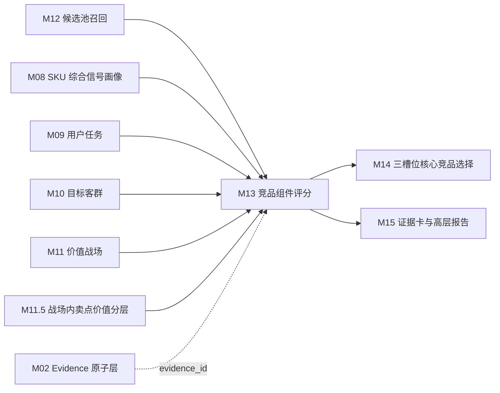

# M13 竞品组件评分模块 SOP 需求

## 0. 单模块强化状态

本文件已按“单模块逐一强化”要求完成第一轮强化。下一步应处理 M14 三槽位核心竞品选择模块。

## 1. 模块目标

M13 对 M12 召回的候选 SKU 进行 pair 级组件评分，解释“候选为什么像竞品、在哪些维度构成竞争压力、适合哪类竞品角色、证据强弱如何”。M13 输出组件分、角色分、证据拆解和复核问题，为 M14 三槽位核心竞品选择提供可解释输入。

M13 不直接选择核心三竞品，也不生成领导报告。它的价值是把 M12 的“候选为什么进入池”进一步量化为“候选在哪些维度构成压力”。

M13 要回答六个问题：

1. 目标 SKU 和候选 SKU 是否争夺同一用户价值战场？
2. 双方是否处于可比较的价格、尺寸、渠道和市场位置？
3. 候选是否在关键参数、卖点价值、任务或用户感知上形成正面对打或拦截？
4. 候选更像正面对打、价格/销量挤压，还是高端标杆/潜在下探？
5. 组件分背后的证据是否完整、可靠、可追溯？
6. 哪些候选虽然分数不低，但因为证据缺失、样本不足、服务信号过重或同质重复，需要 M14 谨慎选择？

M13 的输出用于展示页七步推导中的“⑥ 组件评分”。页面主屏不展示完整公式，只展示价格、渠道、参数、卖点、任务、销量、趋势等业务化证据。

## 2. 设计依据

本模块依据：

- `cankao/CatForge_竞品生成SOP_详细指导_v1.md` 的 M13 要求。
- `cankao/catforge_sop_md/modules/M13_竞品组件评分模块.md`。
- `cankao/CatForge_核心竞品展示页_UI设计规范_v1.md` 中组件评分、候选池未选原因和汇报摘要要求。
- M12 已强化后的候选池、召回理由、关系类型和 pair 级特征快照。
- M08 已强化后的 SKU 综合信号画像。
- M09 已强化后的用户任务结果。
- M10 已强化后的目标客群结果。
- M11 已强化后的价值战场结果。
- M11.5 已强化后的战场内卖点价值分层。
- M07 已强化后的市场画像和可比池基线。
- [00 真实样例数据基线](00_real_data_baseline.md)。
- 数据分层原则：M13 默认消费 M12 和上游画像结果，不直接读取原始表做业务判断。

## 3. 上游输入

### 3.1 必须输入

| 输入 | 来源 | 用途 |
| --- | --- | --- |
| `core3_candidate_pool` | M12 | 目标-候选 pair、召回来源、关系类型和召回强度 |
| `core3_candidate_recall_reason` | M12 | 候选多入口召回理由 |
| `core3_candidate_feature_snapshot` | M12 | M13 评分所需 pair 级特征快照 |
| `core3_sku_signal_profile` | M08 | 目标和候选 SKU 画像补充 |
| `core3_sku_market_profile` | M07，经 M08 汇总 | 价格、销量、销额、平台、趋势 |
| `core3_sku_task_score` | M09 | 任务相似和任务强弱 |
| `core3_sku_target_group_score` | M10 | 客群相似和购买动机 |
| `core3_sku_battlefield_score` | M11 | 战场相似和战场强弱 |
| `core3_sku_claim_value_layer` | M11.5 | 战场内卖点价值层级相似和优劣 |
| `core3_evidence_atom` | M02 | evidence 回溯 |

### 3.2 从 M12 消费的 pair 特征

M13 默认以 M12 输出的 `core3_candidate_feature_snapshot` 为主输入，避免重新拼接上游散表。

| M12 特征 | M13 用途 |
| --- | --- |
| `battlefield_overlap_json` | 战场重合分、角色分 |
| `task_overlap_json` | 用户任务重合分 |
| `audience_overlap_json` | 目标客群重合分 |
| `claim_value_overlap_json` | 卖点价值对打分、配置拦截、标杆判断 |
| `price_feature_json` | 价格相似、价格优势、下探风险 |
| `channel_feature_json` | 平台和渠道重合 |
| `size_feature_json` | 尺寸同段、相邻、升级/降级替代 |
| `market_feature_json` | 销量、销额、趋势、样本状态 |
| `quality_feature_json` | 缺失、冲突、样本不足 |
| `evidence_ids` | 代表证据 |

如果 M12 未提供 pair 级特征快照，M13 不应直接回读原始表拼评分，应输出 `missing_pair_feature_snapshot` 复核问题。

### 3.3 明确不直接消费

| 数据 | 处理 |
| --- | --- |
| 原始 `week_sales_data`、`attribute_data`、`selling_points_data`、`comment_data` | 不直接读取 |
| M12 未召回的全量 SKU | 不绕过候选池评分 |
| M14 三槽位选择结果 | M14 是下游 |
| M15 报告结果 | M15 是下游 |

## 4. 本模块不做什么

- 不增删候选池。候选池由 M12 负责。
- 不绕过 M12 去全量 SKU 中找更高分候选。
- 不选择 0-3 个核心竞品，M14 负责。
- 不生成高层报告文案，M15 负责。
- 不用单一总分替代组件解释。
- 不把服务保障信号当成产品核心竞争分。
- 不把结构化卖点缺失当成卖点弱，只能作为证据缺口。
- 不把同品牌候选排除在竞品评分之外。

## 5. 评分原则

M13 的评分必须同时满足四个原则：

1. 业务可解释：每个高分组件都要有中文原因和 evidence。
2. 组件可拆解：总分只作辅助，不能覆盖战场、价格、渠道、参数、卖点、销量、评论等分项。
3. 角色独立：正面对打、价格/销量挤压、高端标杆/潜在下探的得分口径不同，不能用一个相似度包打天下。
4. 证据和分数分离：低分和证据不足必须区分。证据不足不能被解释成业务能力弱。

## 6. 组件分设计

组件分取值建议为 0-1，所有组件必须输出 `score`、`confidence`、`support_summary_cn`、`risk_flags` 和 `evidence_ids`。

### 6.1 基础可比性分 `base_comparability_score`

衡量候选是否具备进入业务比较的基础条件。

输入：

- M12 `size_feature_json`
- M12 `price_feature_json`
- M12 `channel_feature_json`
- M08 SKU 主数据和数据完整度

评分逻辑：

| 场景 | 分值倾向 |
| --- | --- |
| 同品类、同尺寸、同价位、平台重合 | 高 |
| 同品类、相邻尺寸、相邻价格带 | 中高 |
| 尺寸或价格跨度较大，但 M12 标记升级/降级替代 | 中 |
| 缺价格、缺尺寸、缺平台或画像缺失 | 降权 |

当前真实数据只有线上渠道，平台重合首版基于专业电商和平台电商，不生成线下渠道结论。

### 6.2 战场重合分 `battlefield_fit_score`

衡量目标和候选是否在同一价值战场竞争。

输入：

- M11 `core3_sku_battlefield_score`
- M12 `battlefield_overlap_json`
- M11.5 战场内卖点价值摘要

评分逻辑：

| 场景 | 分值倾向 |
| --- | --- |
| 双方主战场相同 | 高 |
| 目标主战场命中候选次战场 | 中高 |
| 目标次战场命中候选主战场 | 中高 |
| 目标机会战场命中候选主战场且市场压力强 | 中 |
| 只有弱战场重合 | 低 |
| 战场重合但任一方样本不足 | 降置信度 |

必须输出业务解释，例如“双方都在高端画质战场竞争，而不是只因为同为 85 寸”。

### 6.3 用户任务重合分 `task_overlap_score`

衡量双方是否承接相同用户任务。

输入：

- M09 任务得分和关系等级
- M12 `task_overlap_json`

评分逻辑：

- 双方主任务相同：高。
- 目标主任务与候选次任务相同：中高。
- 同一任务组合相似，例如高端画质影音 + 客厅影院观影：中高。
- 任务相近但证据不足：中低。
- 只有评论粗线索支撑：不得高分。

### 6.4 目标客群重合分 `audience_overlap_score`

衡量双方是否争夺同类购买人群。

输入：

- M10 客群得分和关系等级
- M12 `audience_overlap_json`

评分逻辑：

- 同主客群且同任务：高。
- 同客群但任务不同：中。
- 同任务但客群不明：中低。
- 客群证据不足或只由评论命中：降置信度。

### 6.5 价格位置分 `price_position_score`

衡量候选相对目标的价格关系。

输入：

- M07/M08 周均价、最新均价、价格分位
- M12 `price_feature_json`

评分逻辑：

| 价格关系 | 对正面对打 | 对价格挤压 | 对高端标杆 |
| --- | --- | --- | --- |
| 价格接近 | 高 | 中 | 中 |
| 候选明显更低 | 中 | 高 | 低 |
| 候选明显更高 | 中低 | 低 | 高 |
| 价格未知 | 降权 | 降权 | 降权 |

价格口径必须记录使用加权均价、最新均价或指定周期均价。当前市场窗口为 26W01-26W23。

### 6.6 尺寸与形态分 `size_fit_score`

衡量候选尺寸是否构成直接比较、升级或降级替代。

输入：

- M08 尺寸段
- M07 可比池
- M12 `size_feature_json`

评分逻辑：

- 同尺寸：正面对打强。
- 相邻更大尺寸：升级替代或高端标杆。
- 相邻更小尺寸：降级替代或价格挤压。
- 跨尺寸过大：只有任务/价格/市场强时才保留中低分。

### 6.7 渠道平台重合分 `channel_overlap_score`

衡量双方是否在相同销售场域竞争。

输入：

- M07 平台销量和销额占比
- M12 `channel_feature_json`

评分逻辑：

- 专业电商和平台电商占比相近：高。
- 只在一个平台有重合：中。
- 平台缺失或样本不足：降置信度。
- 不生成线下渠道判断。

### 6.8 参数可比分 `param_similarity_score`

衡量双方核心参数是否接近。

输入：

- M08 参数摘要
- M11 战场核心参数
- M12 pair 特征

评分逻辑：

- 在目标主战场核心参数上接近：高。
- 非核心参数接近但战场无关：低权重。
- unknown 不能当 false。
- 参数口径冲突必须降低置信度。

### 6.9 参数优势分 `param_superiority_score`

衡量候选是否在目标关键参数上形成配置拦截或高端标杆。

典型参数：

- 画质：Mini LED/OLED、亮度、分区、色域。
- 游戏体育：刷新率、HDMI2.1、低延迟、运动补偿。
- 大屏：尺寸、价格每英寸。
- 智能：内存、存储、语音、AI。

候选在关键参数明显强于目标时，增强配置拦截和高端标杆角色分；候选参数弱但价格更低时，增强价格挤压解释。

### 6.10 卖点价值对打分 `claim_confrontation_score`

衡量双方在同一战场内关键卖点是否形成正面对打、配置拦截或价格拦截。

输入：

- M11.5 `core3_sku_claim_value_layer`
- M11.5 `core3_sku_battlefield_claim_value_summary`
- M04b 最终卖点激活，经 M08 汇总

评分逻辑：

| 场景 | 解释 |
| --- | --- |
| 同战场核心卖点层级相近 | 正面对打 |
| 候选在关键卖点层级更高 | 配置拦截或高端标杆 |
| 候选层级更弱但价格更低 | 价格/销量挤压 |
| 卖点宣传缺失但参数/评论强 | 可评分但置信度下降 |
| 只有宣传卖点、无参数/评论/市场支撑 | 降权 |
| 服务类卖点匹配 | 只进入服务侧说明，不增强产品核心分 |

### 6.11 市场压力分 `market_threat_score`

衡量候选是否在销售上真实构成压力。

输入：

- M07/M08 销量、销额、均价、平台占比、趋势
- M12 `market_feature_json`

评分逻辑：

- 同可比池销量或销额靠前：高。
- 近期上升明显：高。
- 价格更低且销量不弱：增强价格挤压。
- 高价且销额强：增强高端标杆。
- 市场样本不足：低置信度。

### 6.12 评论感知差异分 `comment_perception_score`

衡量双方在用户反馈中的体验重合和差异。

输入：

- M06 评论下游信号，经 M08 汇总
- M12 pair 特征中的评论和痛点差异

评分逻辑：

- 同任务正向评论都强：增强正面对打。
- 候选在目标痛点上更强：增强拦截关系。
- 候选负向风险明显：降低核心竞品可信度或标记风险。
- 重复评论、空评论、模板评论不得直接进入高分。
- 安装、配送、客服等服务反馈只作为服务体验证据，不能替代产品战场证据。

### 6.13 价格趋势与下探分 `price_trend_score`

衡量候选是否存在价格下探或促销压力。

输入：

- M07 周均价趋势
- M12 市场压力召回理由

评分逻辑：

- 高价候选价格下行并与目标主战场重合：增强潜在下探。
- 低价候选促销频繁且销量不弱：增强价格/销量挤压。
- 价格波动大但样本不足：进入复核。

### 6.14 证据完整度分 `evidence_completeness_score`

衡量当前 pair 评分证据是否完整。

证据类型包括：

- 市场证据。
- 参数证据。
- 卖点证据。
- 评论证据。
- 任务、客群、战场推导证据。
- 候选召回证据。

规则：

- 分数高但 evidence 弱，需要降低 confidence。
- 结构化卖点缺失不是卖点弱，而是宣传证据缺口。
- 当前 85E7Q 缺结构化卖点时，卖点相关组件可由参数和评论补证，但必须降低宣传证据置信度。

## 7. 三类角色分

M13 必须独立计算三类角色分，供 M14 选择三槽位使用。

### 7.1 正面对打分 `direct_fight_score`

回答：谁和我最像，正在抢同一批用户？

建议首版：

```text
direct_fight_score =
  battlefield_fit_score * 0.22
  + claim_confrontation_score * 0.18
  + task_overlap_score * 0.14
  + audience_overlap_score * 0.10
  + price_position_score * 0.12
  + size_fit_score * 0.08
  + channel_overlap_score * 0.08
  + market_threat_score * 0.08
```

高分条件：

- 主战场重合。
- 价格和尺寸接近。
- 任务和客群重合。
- 核心卖点价值层级接近。
- 有市场压力和渠道重合。

### 7.2 价格/销量挤压分 `price_volume_pressure_score`

回答：谁用更低价格或更强销量抢走我本来能拿到的需求？

建议首版：

```text
price_volume_pressure_score =
  task_overlap_score * 0.18
  + audience_overlap_score * 0.10
  + price_advantage_score * 0.22
  + market_threat_score * 0.18
  + battlefield_fit_score * 0.12
  + channel_overlap_score * 0.08
  + claim_threshold_sufficiency_score * 0.07
  + price_trend_score * 0.05
```

高分条件：

- 候选更低价。
- 任务/客群和目标重合。
- 核心门槛体验足够。
- 销量或趋势形成压力。
- 渠道平台有重合。

### 7.3 高端标杆/潜在下探分 `benchmark_potential_score`

回答：谁比我更高端，或者如果价格下探会压缩我的上探空间？

建议首版：

```text
benchmark_potential_score =
  param_superiority_score * 0.20
  + claim_superiority_score * 0.18
  + battlefield_fit_score * 0.18
  + sales_amount_strength_score * 0.14
  + price_premium_or_downshift_score * 0.14
  + task_overlap_score * 0.08
  + channel_overlap_score * 0.05
  + evidence_completeness_score * 0.03
```

高分条件：

- 候选在主战场上更高端。
- 参数或卖点价值层级更强。
- 销额或高端市场表现不弱。
- 当前价格更高，但有下探或促销可能。

### 7.4 配置拦截辅助分 `configuration_pressure_score`

M14 首版三槽位不一定单独设“配置拦截”槽位，但 M13 应输出该辅助分，供正面对打和高端标杆解释使用。

高分条件：

- 价格接近。
- 候选关键参数或战场内卖点层级高于目标。
- 目标存在弱感知或结构化卖点缺失。

### 7.5 服务参考分 `service_reference_score`

服务参考分只用于报告和复核，不默认进入核心三槽位。

高分条件：

- 服务保障战场或安装服务卖点强。
- 评论服务信号充足。
- 但产品主战场不足时，不应提升正面对打、价格挤压或高端标杆角色分。

## 8. 总分与置信度

M13 可以生成 `component_total_score`，但总分只能用于 M14 辅助排序，不得单独作为业务结论。

建议首版：

```text
component_total_score =
  base_comparability_score * 0.10
  + battlefield_fit_score * 0.16
  + task_overlap_score * 0.10
  + audience_overlap_score * 0.08
  + price_position_score * 0.10
  + size_fit_score * 0.06
  + channel_overlap_score * 0.06
  + param_similarity_score * 0.08
  + claim_confrontation_score * 0.12
  + market_threat_score * 0.10
  + comment_perception_score * 0.04
```

置信度建议：

```text
confidence =
  min(required_component_confidence)
  adjusted_by(evidence_completeness_score, sample_sufficiency, upstream_review_flags)
```

规则：

- 组件总分高但证据完整度低，M14 必须看到 `high_score_low_confidence` 风险。
- 候选只有服务或评论证据，角色分必须封顶。
- 上游 M12 标记 `review_only` 的候选，M13 可评分但不应高置信。

## 9. 输出数据契约

### 9.1 `core3_candidate_component_score`

记录候选 pair 的组件总览，是 M14 的主输入。

| 字段 | 说明 |
| --- | --- |
| `project_id` | 项目 |
| `category_code` | 品类，MVP 为 `TV` |
| `batch_id` | 批次 |
| `target_sku_code` | 目标 SKU |
| `target_model_name` | 目标型号 |
| `candidate_sku_code` | 候选 SKU |
| `candidate_model_name` | 候选型号 |
| `candidate_brand_name` | 候选品牌 |
| `candidate_relation_types_json` | M12 候选关系类型 |
| `recall_strength` | M12 召回强度 |
| `base_comparability_score` | 基础可比性分 |
| `battlefield_fit_score` | 战场重合分 |
| `task_overlap_score` | 用户任务重合分 |
| `audience_overlap_score` | 客群重合分 |
| `price_position_score` | 价格位置分 |
| `price_advantage_score` | 价格优势分 |
| `size_fit_score` | 尺寸形态分 |
| `channel_overlap_score` | 渠道平台重合分 |
| `param_similarity_score` | 参数相似分 |
| `param_superiority_score` | 参数优势分 |
| `claim_confrontation_score` | 卖点价值对打分 |
| `claim_superiority_score` | 卖点优势分 |
| `market_threat_score` | 市场压力分 |
| `sales_amount_strength_score` | 销额强度分 |
| `comment_perception_score` | 评论感知差异分 |
| `price_trend_score` | 价格趋势与下探分 |
| `evidence_completeness_score` | 证据完整度 |
| `component_total_score` | 组件总分 |
| `confidence` | 综合置信度 |
| `sample_status` | sufficient/limited/insufficient |
| `main_strengths_json` | 候选强支撑点 |
| `main_gaps_json` | 候选证据缺口 |
| `risk_flags_json` | 风险 |
| `review_required` | 是否需要复核 |
| `review_reason` | 复核原因 |
| `evidence_ids` | 核心 evidence |
| `feature_snapshot_id` | M12 pair 特征快照 |
| `rule_version` | 规则版本 |
| `created_at` | 创建时间 |
| `updated_at` | 更新时间 |

### 9.2 `core3_candidate_role_score`

记录候选适配不同竞品角色的分数，是 M14 三槽位选择的直接输入。

| 字段 | 说明 |
| --- | --- |
| `project_id` | 项目 |
| `category_code` | 品类 |
| `batch_id` | 批次 |
| `target_sku_code` | 目标 SKU |
| `candidate_sku_code` | 候选 SKU |
| `role_code` | direct_fight/price_volume_pressure/benchmark_potential/configuration_pressure/service_reference |
| `role_name_cn` | 中文角色名 |
| `role_score` | 角色分 |
| `role_confidence` | 角色置信度 |
| `role_rank_hint` | 角色内排序提示 |
| `role_business_reason_cn` | 中文角色解释 |
| `positive_evidence_ids` | 支撑证据 |
| `weakening_evidence_ids` | 削弱证据 |
| `risk_flags_json` | 风险 |
| `created_at` | 创建时间 |

### 9.3 `core3_candidate_component_explanation`

记录每个组件的解释，供 M15 证据卡和技术详情使用。

| 字段 | 说明 |
| --- | --- |
| `project_id` | 项目 |
| `category_code` | 品类 |
| `batch_id` | 批次 |
| `target_sku_code` | 目标 SKU |
| `candidate_sku_code` | 候选 SKU |
| `component_code` | 组件 code |
| `component_name_cn` | 中文组件名 |
| `score` | 分值 |
| `confidence` | 置信度 |
| `support_level` | strong/medium/weak/missing/conflict |
| `business_explanation_cn` | 中文业务解释 |
| `supporting_evidence_ids` | 支撑证据 |
| `weakening_evidence_ids` | 削弱证据 |
| `source_payload_json` | 结构化来源摘要 |
| `created_at` | 创建时间 |

### 9.4 `core3_candidate_score_review_issue`

记录评分复核问题。

| 字段 | 说明 |
| --- | --- |
| `project_id` | 项目 |
| `category_code` | 品类 |
| `batch_id` | 批次 |
| `target_sku_code` | 目标 SKU |
| `candidate_sku_code` | 候选 SKU |
| `issue_type` | missing_feature_snapshot/no_market/no_semantic/only_service/high_score_low_confidence/param_conflict/claim_missing/sample_insufficient |
| `issue_level` | warning/blocker |
| `issue_message_cn` | 中文问题说明 |
| `evidence_ids` | 相关证据 |
| `resolved_status` | open/resolved/ignored |
| `created_at` | 创建时间 |

## 10. 质量规则

| 规则 | 要求 |
| --- | --- |
| 只评分 M12 候选 | 不绕过候选池读全量 SKU |
| 组件分可解释 | 每个组件必须有中文解释和 evidence |
| 角色分独立 | 正面对打、价格挤压、高端标杆口径不同 |
| 总分不作结论 | 总分只给 M14 辅助，不单独生成业务结论 |
| 同品牌可评分 | 当前数据全是海信，同品牌候选必须正常评分 |
| 线上渠道边界 | 当前只基于线上平台，不生成线下渠道判断 |
| 23 周市场口径 | 使用 26W01-26W23 周维度量价，不写 12 个月 |
| unknown 不当 false | 缺失降低置信度，不当成能力弱 |
| 结构化卖点缺失可表达 | 缺失是宣传证据缺口，不直接等于卖点弱 |
| 服务信号有边界 | 服务保障不提升产品核心角色分 |
| 证据质量参与置信度 | 高分低证据必须标记风险 |
| 下游稳定 | M14 不需要重新计算组件分 |

## 11. 复核触发条件

M13 需要向 M16 产生以下复核提示：

- M12 候选缺 `core3_candidate_feature_snapshot`。
- 候选缺 M08 画像或基础主数据。
- 候选缺市场证据，但市场压力分或价格挤压分较高。
- 候选缺语义证据，但正面对打分较高。
- 候选只有服务或评论证据，却出现高角色分。
- 结构化卖点缺失导致卖点对打分置信度低。
- 参数口径冲突影响高刷、HDMI、亮度、分区、护眼等关键组件。
- 样本不足但角色分接近 M14 选择阈值。
- 组件总分高但任一关键组件置信度低。
- 同一型号族候选得分高度重复，需要 M14 判断业务信息增量。

## 12. 面向 85E7Q 的需求

M13 必须能解释以下问题：

| 问题 | 评分要求 |
| --- | --- |
| 85E7Q 与其他 85 寸型号是否同价同尺寸正面对打 | 使用尺寸、价格、平台、战场、任务和卖点价值组件共同解释 |
| 85E7Q 的 Mini LED、亮度、分区是否形成高端画质优势 | 使用参数优势、卖点价值对打、战场重合和市场压力解释 |
| 85E7Q 的 300HZ、HDMI2.1 是否形成游戏体育压力 | 使用高刷、HDMI、游戏/体育任务、评论和市场证据解释，缺低延迟或游戏评论要降置信度 |
| 85E7Q 没有结构化卖点数据怎么办 | 允许参数和评论补证，但卖点组件置信度必须体现宣传证据缺口 |
| 安装、配送、客服等服务反馈如何处理 | 只进入服务参考或评论风险，不替代产品战场和产品卖点组件 |
| 当前只有海信品牌怎么办 | 解释为同品牌内部竞争、同系列替代或同价位挤压，不写外部品牌对抗 |
| 75/100 寸相邻尺寸如何评分 | 作为升级/降级替代或大屏价值压力，不当作同尺寸正面对打 |

## 13. 与其他模块关系



下游消费边界：

| 下游模块 | 使用 M13 内容 | 边界 |
| --- | --- | --- |
| M14 三槽位选择 | 组件分、角色分、风险、未选提示 | M14 负责去重、互斥和最终选择 |
| M15 报告 | 组件解释、角色解释、证据矩阵 | M15 转成高层业务语言，不展示完整公式 |
| M16 增量编排 | 评分复核问题和依赖版本 | 上游变化触发重算 |

## 14. 增量重算要求

| 变化来源 | M13 动作 | 下游影响 |
| --- | --- | --- |
| M12 候选池变化 | 新增、删除或重算对应 pair 评分 | M14-M16 |
| M12 pair 特征快照变化 | 重算对应 pair 组件分和角色分 | M14-M16 |
| M08 画像变化 | 重算受影响目标或候选 pair | M13-M16 |
| M09 任务变化 | 重算任务和角色相关组件 | M13-M16 |
| M10 客群变化 | 重算客群相关组件 | M13-M16 |
| M11 战场变化 | 重算战场和角色相关组件 | M13-M16 |
| M11.5 卖点价值变化 | 重算卖点对打、配置拦截、标杆相关组件 | M13-M16 |
| M07 市场画像变化 | 重算价格、渠道、销量、趋势组件 | M13-M16 |
| M02 evidence 状态变化 | 更新组件解释和置信度 | M15/M16 |
| 评分规则变化 | 按 `rule_version` 重算组件分和角色分 | M14-M16 |

增量运行时需要保留历史版本，不覆盖原评分；新结果以 `batch_id + target_sku_code + candidate_sku_code + feature_snapshot_id + rule_version` 区分。

## 15. 验收标准

| 验收项 | 标准 |
| --- | --- |
| 只评分 M12 候选 | 必须 |
| 不直接读取原始表做结论 | 必须 |
| 组件分可拆解 | 必须输出组件分和组件解释 |
| 三角色分独立计算 | 正面对打、价格/销量挤压、高端标杆/潜在下探必须分开 |
| 量价进入评分 | 价格、销量、销额、趋势和平台必须参与 |
| M11/M11.5 进入评分 | 战场和战场内卖点价值必须参与 |
| 证据质量参与置信度 | 高分低证据必须提示 |
| 同品牌候选可评分 | 海信 SKU 之间可形成竞品关系 |
| 服务信号有边界 | 服务不能替代产品核心组件 |
| 85E7Q 可解释 | 能说明同尺寸正面对打、高端画质、游戏体育、价格挤压、卖点缺失等评分依据 |
| M14 可直接消费 | 必须输出候选角色分和风险 |
| 高层页可展示 | 可转成价格、渠道、参数、卖点、任务、销量、趋势的业务证据 |
