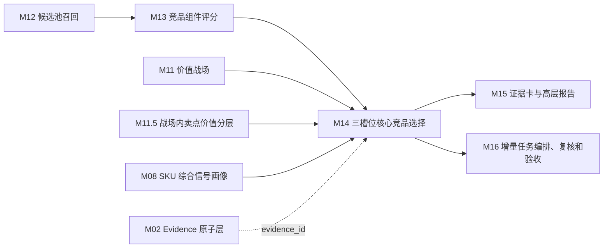

# M14 三槽位核心竞品选择模块 SOP 需求

## 0. 单模块强化状态

本文件已按“单模块逐一强化”要求完成第一轮强化。下一步应处理 M15 证据卡与高层报告模块。

## 1. 模块目标

M14 从 M13 已评分候选池中选择 0-3 个核心竞品，并为每个入选 SKU 给出明确业务角色、选择理由、证据完整度、策略含义和风险说明。M14 是核心竞品判断模块，但不是 TopN 排名模块。

M14 的目标是让业务领导一眼理解：

1. 当前目标 SKU 最值得关注的 2-3 个核心竞品是谁。
2. 每个竞品分别代表什么竞争压力。
3. 为什么不是简单从候选池按总分取前三。
4. 为什么有些候选分数不低但没有入选。
5. 如果无法选满 3 个，缺口和复核原因是什么。

M14 的输出用于展示页核心竞品卡和七步推导中的“⑦ 三槽位选择”。本模块必须输出业务语言可读的结论，但不负责最终页面排版和报告生成，M15 负责展示与报告。

## 2. 设计依据

本模块依据：

- `cankao/CatForge_竞品生成SOP_详细指导_v1.md` 的 M14 要求。
- `cankao/catforge_sop_md/modules/M14_三槽位核心竞品选择模块.md`。
- `cankao/CatForge_核心竞品展示页_UI设计规范_v1.md` 中“三张业务角色卡”“不要硬凑”“候选池与未选原因”要求。
- M12 已强化后的候选池、候选关系类型和召回理由。
- M13 已强化后的组件分、角色分、证据完整度和评分复核问题。
- M11/M11.5 已强化后的价值战场和战场内卖点价值分层。
- M08 已强化后的 SKU 综合信号画像。
- [00 真实样例数据基线](00_real_data_baseline.md)。
- 数据分层原则：M14 默认消费 M12/M13/M11/M11.5/M08 上游产物，不直接读取原始表做业务判断。

## 3. 上游输入

### 3.1 必须输入

| 输入 | 来源 | 用途 |
| --- | --- | --- |
| `core3_candidate_pool` | M12 | 候选 pair、召回关系、召回强度 |
| `core3_candidate_recall_reason` | M12 | 候选进入池的多入口原因 |
| `core3_candidate_feature_snapshot` | M12 | 目标-候选 pair 特征快照 |
| `core3_candidate_component_score` | M13 | 组件总览、组件分、风险和证据完整度 |
| `core3_candidate_role_score` | M13 | 正面对打、价格/销量挤压、高端标杆/潜在下探等角色分 |
| `core3_candidate_component_explanation` | M13 | 组件解释和 evidence |
| `core3_sku_battlefield_portfolio` | M11 | 目标 SKU 主/次/机会战场组合 |
| `core3_sku_battlefield_claim_value_summary` | M11.5 | 目标和候选的战场内卖点价值组合 |
| `core3_sku_signal_profile` | M08 | 目标和候选的 SKU 画像、风险、缺失 |
| `core3_evidence_atom` | M02 | evidence 回溯 |

### 3.2 从 M13 消费的核心字段

M14 不重新计算组件分，只消费 M13 结果。

| M13 字段 | M14 用途 |
| --- | --- |
| `component_total_score` | 辅助排序，不可单独决定入选 |
| `direct_fight_score` | 正面对打槽位候选排序 |
| `price_volume_pressure_score` | 价格/销量挤压槽位候选排序 |
| `benchmark_potential_score` | 高端标杆/潜在下探槽位候选排序 |
| `configuration_pressure_score` | 配置拦截辅助判断 |
| `service_reference_score` | 服务参考，默认不进入产品核心三槽位 |
| `evidence_completeness_score` | 入选置信度和复核 |
| `confidence` | 入选置信度 |
| `sample_status` | 样本充分性 |
| `risk_flags_json` | 入选风险 |
| `main_strengths_json` | 入选理由素材 |
| `main_gaps_json` | 风险和未选原因素材 |

### 3.3 明确不直接消费

| 数据 | 处理 |
| --- | --- |
| 原始 `week_sales_data`、`attribute_data`、`selling_points_data`、`comment_data` | 不直接读取 |
| M12 未召回候选之外的全量 SKU | 不绕过候选池补选 |
| M15 报告 payload | M15 是下游 |

## 4. 本模块不做什么

- 不生成原始候选，M12 负责。
- 不重新计算组件分，M13 负责。
- 不直接读取原始表。
- 不强行凑满 3 个核心竞品。
- 不输出几十个 TopN 列表。
- 不因为候选总分高就直接入选。
- 不排除同品牌 SKU。当前样例全部是海信，同品牌内部 SKU 可以入选。
- 不把服务参考候选当成产品核心竞品。
- 不生成最终页面和报告，M15 负责。

## 5. 三槽位定义

MVP 使用三个业务槽位。每个槽位回答一个不同的业务问题。

| 槽位 code | 中文名称 | 业务问题 | 典型策略含义 |
| --- | --- | --- | --- |
| `direct_fight` | 正面对打竞品 | 谁和我最像，正在抢同一批用户？ | 定价、核心卖点表达和渠道对位 |
| `price_volume_pressure` | 价格/销量挤压竞品 | 谁以更低价格、更强销量或足够体验抢走需求？ | 价格防守、促销监控、权益包设计 |
| `benchmark_potential` | 高端标杆/潜在下探竞品 | 谁更强，或降价后会压到我？ | 上探空间判断、高端防御和参数对比 |

槽位可以为空。输出 0-3 个核心竞品都是合法结果。不得为了页面好看硬凑 3 个。

## 6. 选择总体流程

```text
读取 M12 候选池
→ 读取 M13 组件分和角色分
→ 构建三个槽位候选列表
→ 应用槽位硬门槛和封顶规则
→ 计算槽位选择分
→ 跨槽去重与业务信息增量判断
→ 选择 0-3 个核心竞品
→ 生成入选理由、未选原因和空槽说明
→ 输出 M15 可消费的核心竞品结构
```

### 6.1 读取候选池和评分

M14 只处理 M12 输出且 M13 已评分的候选。以下情况不进入选择：

- 候选未出现在 `core3_candidate_pool`。
- 候选缺少 M13 角色分。
- 候选缺基础 SKU 主数据。
- 候选被 M13 标记为 blocker 且未复核通过。

### 6.2 构建槽位候选列表

同一个候选可以先进入多个槽位候选列表，但最终只能占用一个核心槽位。

| 槽位 | 进入槽位候选的最低条件 |
| --- | --- |
| 正面对打 | `direct_fight_score` 达到候选阈值，且战场/价格/尺寸/渠道至少两类可比 |
| 价格/销量挤压 | `price_volume_pressure_score` 达到候选阈值，且存在价格优势、销量优势或价格下探信号 |
| 高端标杆/潜在下探 | `benchmark_potential_score` 达到候选阈值，且存在参数/卖点优势、高端价格锚点或下探风险 |

候选阈值由规则版本配置，需求层建议：

```text
role_score >= 0.60 才进入槽位候选
confidence >= 0.50 才可自动入选
evidence_completeness_score >= 0.50 才可自动入选
```

低于阈值但业务有价值的候选可以进入 `review_candidate`，不能自动入选。

## 7. 槽位入选规则

### 7.1 正面对打竞品

业务定义：候选与目标 SKU 在主价值战场、核心任务、价格/尺寸、渠道和关键卖点价值上高度接近，是用户在同一预算和购买场景下最可能同时比较的型号。

自动入选建议条件：

- `direct_fight_score` 在槽位候选中领先。
- 目标和候选至少一个主战场重合，或目标主战场命中候选次战场。
- 价格带接近，或 M12 已明确标记为正面对打。
- 同尺寸或相邻尺寸，且不是纯升级/降级替代。
- 平台渠道有有效重合。
- 至少 3 类证据有效：战场、价格/尺寸、卖点/参数、市场、任务/客群、评论中至少 3 类。
- 服务信号不是主要支撑。

必须输出的解释：

- 双方在哪个战场正面对打。
- 为什么这个战场是目标 SKU 的主/重要战场。
- 为什么这个战场也是候选 SKU 的主/重要战场。
- 双方对打的核心卖点、参数或体验是什么。
- 目标 SKU 优势和候选 SKU 优势分别是什么。

### 7.2 价格/销量挤压竞品

业务定义：候选不一定与目标 SKU 配置完全相同，但能满足相近用户任务或客群，并通过更低价格、更强销量、促销趋势或足够门槛体验对目标 SKU 形成替代压力。

自动入选建议条件：

- `price_volume_pressure_score` 在槽位候选中领先。
- 与目标有任务、客群或战场重合。
- 候选价格更低，或同价下销量/销额/趋势明显更强。
- 目标核心体验没有完全断档，至少满足该战场基础门槛卖点。
- 平台渠道有有效重合。
- 市场压力证据有效，不能只有语义相似。

必须输出的解释：

- 候选以什么方式挤压目标：价格、销量、促销、门槛体验或渠道。
- 挤压发生在哪个任务、客群或战场。
- 目标 SKU 的防守点是什么。
- 候选 SKU 的价格或销量压力证据是什么。

### 7.3 高端标杆/潜在下探竞品

业务定义：候选在目标核心战场上更高端或更强，当前可能价格更高；如果价格下探或促销进入目标价格带，将压缩目标 SKU 的上探空间或高端认知。

自动入选建议条件：

- `benchmark_potential_score` 在槽位候选中领先。
- 与目标主/次战场有重合。
- 候选在关键参数、战场内卖点价值层级或销额表现上强于目标。
- 当前价格高于目标，或存在价格下探/促销进入目标带的信号。
- 不是只有参数强，至少还要有市场、战场或卖点价值证据之一。

必须输出的解释：

- 候选在哪个高端战场或关键卖点上强于目标。
- 当前是高端标杆还是潜在下探。
- 如果下探，对目标的上探空间或防守边界有什么影响。
- 目标 SKU 相对该候选的优势是什么。

## 8. 槽位选择分

M14 可以计算 `slot_selection_score`，用于槽位内排序。它不是 M13 组件总分的重复，而是面向“是否值得作为核心竞品展示”的选择分。

建议首版：

```text
slot_selection_score =
  role_score * 0.45
  + evidence_completeness_score * 0.15
  + market_pressure_or_validity_score * 0.15
  + business_distinctiveness_score * 0.15
  + strategic_value_score * 0.10
  - selection_risk_penalty
```

说明：

- `role_score` 来自 M13 对应角色分。
- `business_distinctiveness_score` 判断该候选是否提供与已选候选不同的业务信息。
- `strategic_value_score` 判断该候选是否对定价、防守、上探或卖点表达有明确策略意义。
- `selection_risk_penalty` 包括高分低证据、样本不足、服务信号过重、同系列重复、关键字段缺失等。

## 9. 去重、互斥与冲突处理

### 9.1 同一候选跨槽冲突

同一个 `candidate_sku_code` 只能占用一个槽位。

处理规则：

1. 优先放入该候选 `role_score` 最高且证据最完整的槽位。
2. 如果两个槽位分数接近，选择业务解释更强、策略含义更清晰的槽位。
3. 如果候选作为价格挤压和正面对打都成立，优先看价格关系：价格接近偏正面对打，明显低价偏价格/销量挤压。
4. 如果候选作为正面对打和高端标杆都成立，优先看参数/卖点优势和价格关系：明显高端偏标杆，接近偏正面对打。

### 9.2 同系列或高度重复候选

M14 不做品牌排除，但需要处理同系列高度重复。

规则：

- 不设置“同一品牌最多 1 个”。当前样例全部是海信，品牌上限会导致无法选择。
- 同系列、同尺寸、同价位、同战场且证据高度重合时，优先保留业务信息增量更强的候选。
- 如果同系列两个候选分别代表不同压力，例如一个低价挤压、一个高端下探，可以同时入选不同槽位，但必须解释差异。
- 被去重候选进入 `core3_competitor_selection_audit`，说明“与已选候选业务信息重复”。

### 9.3 总分高但不入选

以下候选即使 M13 总分高，也不能自动入选：

- 证据完整度低。
- 样本不足。
- 只有服务信号或评论信号。
- 与已选候选高度重复。
- 战场与目标主线不一致。
- 组件高分来自非核心参数或非核心卖点。
- 对业务决策没有明显增量。

这些候选要输出未选原因，供 M15 在“候选池与未选原因”折叠区展示。

## 10. 空槽与不足处理

如果某个槽位没有高置信候选，M14 必须输出空槽说明，而不是强行补一个弱候选。

空槽原因类型：

| 类型 | 说明 |
| --- | --- |
| `no_candidate` | 没有候选进入槽位 |
| `low_confidence` | 有候选但置信度不足 |
| `insufficient_market_evidence` | 市场证据不足 |
| `insufficient_semantic_evidence` | 战场/任务/卖点证据不足 |
| `duplicate_with_selected` | 候选与已选竞品高度重复 |
| `service_only` | 候选只有服务侧价值 |
| `sample_limited` | 可比池或评论样本不足 |

空槽对 M15 的展示建议：

```text
暂无高置信候选
原因：高端下探候选样本不足 / 需专家复核
```

## 11. 核心竞品结论结构

每个入选核心竞品必须包含六层信息：

1. 结论：它是什么角色的核心竞品。
2. 主战场：它在哪个价值战场对目标 SKU 构成压力。
3. 推导：从战场、任务、客群、卖点价值、市场压力逐步说明。
4. 证据：列出关键 evidence。
5. 差异：目标 SKU 优势和竞品优势。
6. 风险：说明样本不足、卖点缺失、评论噪声或同品牌内部口径等限制。

面向高层的一句话理由要能直接放进卡片，例如：

```text
它与 85E7Q 在 85 寸、高端画质战场和线上主销渠道上高度接近，是用户在同一预算下最可能同时比较的型号。
```

## 12. 输出数据契约

### 12.1 `core3_competitor_selection_run`

记录一次核心三竞品选择运行。

| 字段 | 说明 |
| --- | --- |
| `project_id` | 项目 |
| `category_code` | 品类，MVP 为 `TV` |
| `batch_id` | 批次 |
| `target_sku_code` | 目标 SKU |
| `target_model_name` | 目标型号 |
| `candidate_count` | M12 候选数 |
| `scored_candidate_count` | M13 已评分候选数 |
| `selected_count` | 入选数量，0-3 |
| `empty_slot_count` | 空槽数量 |
| `selection_status` | success/limited/blocked/review_required |
| `selection_summary_cn` | 中文选择摘要 |
| `target_profile_hash` | 目标 M08 画像 hash |
| `rule_version` | 规则版本 |
| `created_at` | 创建时间 |

### 12.2 `core3_competitor_selection`

记录每个入选核心竞品，是 M15 核心竞品卡主输入。

| 字段 | 说明 |
| --- | --- |
| `project_id` | 项目 |
| `category_code` | 品类 |
| `batch_id` | 批次 |
| `target_sku_code` | 目标 SKU |
| `target_model_name` | 目标型号 |
| `candidate_sku_code` | 入选竞品 SKU |
| `candidate_model_name` | 入选竞品型号 |
| `candidate_brand_name` | 入选竞品品牌 |
| `slot_code` | direct_fight/price_volume_pressure/benchmark_potential |
| `slot_name_cn` | 中文槽位名 |
| `selection_rank` | 槽位内顺序，MVP 每槽最多 1 个 |
| `primary_battlefield_code` | 主要战场 |
| `primary_battlefield_name_cn` | 主要战场中文名 |
| `slot_selection_score` | 槽位选择分 |
| `role_score` | M13 对应角色分 |
| `component_total_score` | M13 组件总分 |
| `confidence` | 入选置信度 |
| `pressure_level` | high/medium_high/medium/review_required |
| `business_conclusion_cn` | 一句话业务结论 |
| `battlefield_reason_cn` | 战场理由 |
| `task_audience_reason_cn` | 任务/客群理由 |
| `claim_value_reason_cn` | 卖点价值理由 |
| `price_channel_reason_cn` | 价格/渠道理由 |
| `market_reason_cn` | 市场压力理由 |
| `target_advantage_cn` | 目标 SKU 优势 |
| `competitor_advantage_cn` | 入选竞品优势 |
| `strategy_implication_cn` | 策略含义 |
| `risk_note_cn` | 证据风险 |
| `component_scores_json` | M13 关键组件分 |
| `evidence_ids` | 关键 evidence |
| `review_required` | 是否需要复核 |
| `review_reason` | 复核原因 |
| `rule_version` | 规则版本 |
| `created_at` | 创建时间 |
| `updated_at` | 更新时间 |

### 12.3 `core3_competitor_slot_decision`

记录每个槽位的选择状态，包括空槽。

| 字段 | 说明 |
| --- | --- |
| `project_id` | 项目 |
| `category_code` | 品类 |
| `batch_id` | 批次 |
| `target_sku_code` | 目标 SKU |
| `slot_code` | 槽位 |
| `slot_name_cn` | 中文槽位名 |
| `decision_status` | selected/empty/review_required |
| `selected_candidate_sku_code` | 入选候选，可为空 |
| `top_candidate_sku_code` | 最高候选，可为空 |
| `slot_candidate_count` | 槽位候选数 |
| `empty_reason_code` | 空槽原因 |
| `empty_reason_cn` | 空槽中文说明 |
| `review_reason` | 复核原因 |
| `created_at` | 创建时间 |

### 12.4 `core3_competitor_selection_audit`

记录入选、未选和复核候选的决策原因。

| 字段 | 说明 |
| --- | --- |
| `project_id` | 项目 |
| `category_code` | 品类 |
| `batch_id` | 批次 |
| `target_sku_code` | 目标 SKU |
| `candidate_sku_code` | 候选 SKU |
| `candidate_model_name` | 候选型号 |
| `evaluated_slot_codes_json` | 被评估的槽位 |
| `decision` | selected/rejected/review |
| `selected_slot_code` | 入选槽位，可为空 |
| `decision_reason_cn` | 中文决策理由 |
| `failed_conditions_json` | 未满足条件 |
| `candidate_total_score` | M13 总分 |
| `best_role_score` | 最高角色分 |
| `evidence_completeness_score` | 证据完整度 |
| `risk_flags_json` | 风险 |
| `evidence_ids` | 证据 |
| `created_at` | 创建时间 |

### 12.5 `core3_competitor_selection_review_issue`

记录需要 M16 或业务复核的问题。

| 字段 | 说明 |
| --- | --- |
| `project_id` | 项目 |
| `category_code` | 品类 |
| `batch_id` | 批次 |
| `target_sku_code` | 目标 SKU |
| `slot_code` | 槽位，可为空 |
| `candidate_sku_code` | 候选，可为空 |
| `issue_type` | no_candidate/low_confidence/high_score_low_evidence/duplicate_candidate/service_only/sample_limited/selection_conflict |
| `issue_level` | warning/blocker |
| `issue_message_cn` | 中文问题说明 |
| `evidence_ids` | 相关证据 |
| `resolved_status` | open/resolved/ignored |
| `created_at` | 创建时间 |

## 13. 质量规则

| 规则 | 要求 |
| --- | --- |
| 输出 0-3 个 | 不强行凑满 3 个 |
| 三槽位角色清晰 | 每个入选必须有唯一槽位 |
| 不按总分 TopN | 总分只辅助选择，不能直接取前三 |
| 不排除同品牌 | 当前样例全部海信，同品牌可以入选 |
| 不设品牌上限 | 禁止“同一品牌最多 1 个”这类规则 |
| 同系列要去重 | 同系列高度重复时保留业务增量更强者 |
| 服务边界 | 服务参考候选不默认进入产品核心槽位 |
| 高分低证据要复核 | 不能高置信入选 |
| 卖点缺失不等于弱 | 结构化卖点缺失要写成宣传证据缺口 |
| 市场证据要有效 | 核心竞品必须有价格/销量/销额/趋势中至少一种市场证据，除非明确复核 |
| 业务语言 | 输出给 M15 的理由必须是中文业务语言 |
| 证据可追溯 | 入选和未选理由都要关联 evidence 或缺失原因 |

## 14. 复核触发条件

M14 需要向 M16 产生以下复核提示：

- M12 候选池为空。
- M13 没有可用角色分。
- 三个槽位都为空。
- 某槽位最高候选分数高但证据完整度低。
- 入选候选市场证据不足。
- 入选候选只有服务或评论证据。
- 同一个候选跨多个槽位冲突且分差很小。
- 多个同系列候选高度重复，业务信息增量不足。
- 高端标杆/潜在下探槽位缺少价格下探或高端市场证据。
- 价格/销量挤压槽位缺少有效价格优势或销量证据。
- 正面对打槽位缺少双方主战场依据。

## 15. 面向 85E7Q 的需求

M14 对 85E7Q 选择核心竞品时，必须遵守：

| 要求 | 说明 |
| --- | --- |
| 不把同为 85 寸作为唯一理由 | 必须结合战场、任务、价格、渠道、卖点价值和市场证据 |
| 不写外部品牌对抗 | 当前数据只有海信，应解释为同品牌内部竞争、同系列替代或同价位挤压 |
| 允许海信 SKU 入选 | 85E8Q、85E5Q-PRO、85E5S-PRO、85E52S-PRO 等都应可被正常评估 |
| 正面对打要说明双方战场 | 例如高端画质战场、家庭观影升级战场是否同时成立 |
| 价格挤压要说明防守边界 | 低价候选是否满足大屏换新/家庭观影任务，是否销量有效 |
| 高端标杆要说明上探风险 | 更强参数、更高价格、销额或下探趋势是否成立 |
| 服务评论不能替代产品战场 | 安装、配送、售后只作为服务侧证据或风险 |
| 卖点缺失要写成证据缺口 | 85E7Q 无结构化卖点，应写“宣传卖点数据缺口”，不能写“卖点弱” |

M14 不需要在需求阶段给出 85E7Q 最终入选名单，但开发验收时必须能解释为什么每个入选或未选候选进入对应槽位。

## 16. 与其他模块关系



下游消费边界：

| 下游模块 | 使用 M14 内容 | 边界 |
| --- | --- | --- |
| M15 证据卡与高层报告 | 三槽位入选结果、空槽说明、未选原因、业务结论 | M15 负责展示，不重新选择 |
| M16 增量编排 | 选择状态、复核问题、规则版本 | 上游变化触发重算 |

## 17. 增量重算要求

| 变化来源 | M14 动作 | 下游影响 |
| --- | --- | --- |
| M12 候选池变化 | 重算目标 SKU 三槽位选择 | M15-M16 |
| M13 组件分或角色分变化 | 重算目标 SKU 三槽位选择 | M15-M16 |
| M11 战场变化 | 重算槽位战场理由和资格 | M14-M16 |
| M11.5 卖点价值变化 | 重算卖点价值理由和槽位资格 | M14-M16 |
| M08 画像或证据矩阵变化 | 更新置信度、风险和选择理由 | M14-M16 |
| M02 evidence 状态变化 | 更新入选证据和未选原因 | M15/M16 |
| 选择规则变化 | 按 `rule_version` 重算 | M15-M16 |

增量运行时需要保留历史版本，不覆盖原选择结果；新结果以 `batch_id + target_sku_code + rule_version` 区分。

## 18. 验收标准

| 验收项 | 标准 |
| --- | --- |
| 输出 0-3 个核心竞品 | 必须 |
| 不强行凑满 | 必须 |
| 三个槽位角色清晰 | 正面对打、价格/销量挤压、高端标杆/潜在下探 |
| 每个入选理由可追溯 M13 组件分 | 必须 |
| 每个入选结论有 evidence_ids | 必须 |
| 可输出空槽并说明原因 | 必须 |
| 同品牌 SKU 可入选 | 必须 |
| 不设置品牌上限 | 必须 |
| 正面对打解释包含双方战场依据 | 必须 |
| 价格挤压解释包含价格或销量压力 | 必须 |
| 高端标杆解释包含参数/卖点优势或下探风险 | 必须 |
| 未选候选有原因 | 必须支持 M15 候选池折叠区 |
| 服务信号有边界 | 不替代产品核心竞品选择 |
| 85E7Q 可解释 | 能说明同品牌内部竞争、卖点缺失、三槽位选择或空槽原因 |
