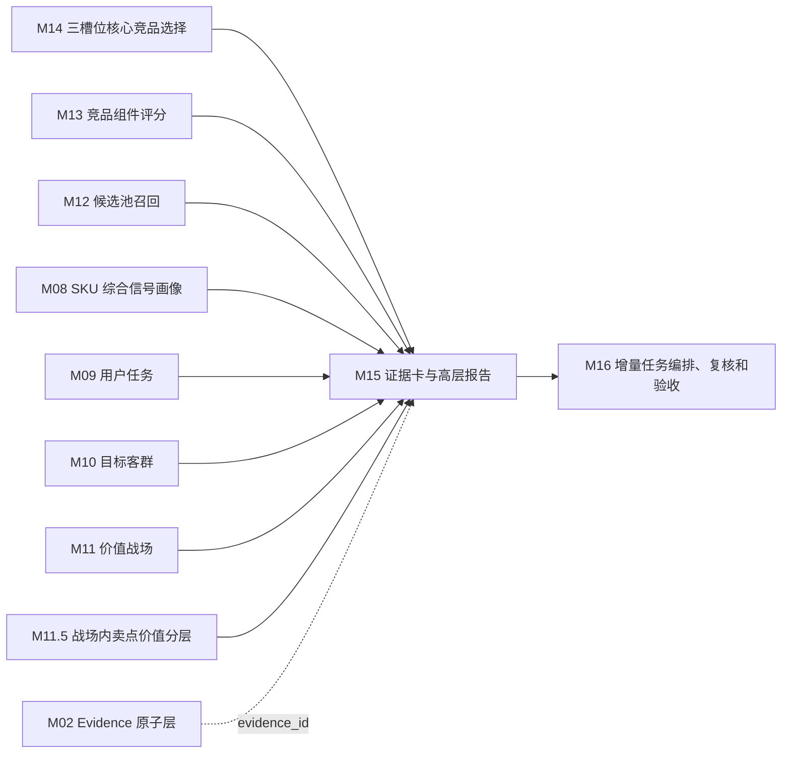

# M15 证据卡与高层报告模块 SOP 需求

## 0. 单模块强化状态

本文件已按“单模块逐一强化”要求完成第一轮强化。下一步应处理 M16 增量任务编排、复核和验收模块。

## 1. 模块目标

M15 把 M14 的核心三竞品选择结果转换成面向业务高层的证据卡、页面展示 payload、可导出的单 SKU 竞品报告，以及可被飞书卡片/小奥问答复用的看板摘要结构。M15 不是算法调试页，不重新计算竞品，不展示内部表名、英文字段、UUID、原始规则代码或过程性 AI 文案。

当 M15 内容被小奥或飞书卡片消费时，完整竞品分析报告应作为佐证层；主回答应优先使用看板摘要结构展示“核心竞品是谁、重合在哪里、会造成什么成交影响、证据入口在哪里”。M15 不负责发送飞书消息，也不负责生成飞书卡片组件 JSON；它只提供业务 payload。

M15 的汇报顺序必须是：

1. 先说核心竞品是谁。
2. 再说每个竞品代表什么竞争压力。
3. 再解释为什么这些 SKU 是竞品。
4. 再展示关键证据、差异和策略含义。
5. 最后提供可展开的 SOP 推导轨迹、候选池未选原因和数据质量说明。

M15 要回答六个问题：

1. 当前目标 SKU 识别出几个核心竞品，分别是谁？
2. 每个核心竞品属于正面对打、价格/销量挤压，还是高端标杆/潜在下探？
3. 为什么系统认为它们是竞品，而不是普通相似 SKU？
4. 结论背后的价格、渠道、参数、卖点、任务、战场、市场和评论证据是什么？
5. 哪些证据还不足，需要业务复核？
6. 这份报告是否适合给高层汇报、导出和继续追踪？

## 2. 设计依据

本模块依据：

- `cankao/CatForge_竞品生成SOP_详细指导_v1.md` 的 M15 要求。
- `cankao/catforge_sop_md/modules/M15_证据卡与高层报告模块.md`。
- `cankao/CatForge_核心竞品展示页_UI设计规范_v1.md` 中核心竞品卡、价值战场摘要、证据矩阵、SOP 推导轨迹、候选池与未选原因、报告导出和空状态规范。
- M14 已强化后的三槽位核心竞品选择、空槽说明和未选原因。
- M13 已强化后的组件分、角色分和组件解释。
- M12 已强化后的候选池摘要和召回理由。
- M08-M11.5 已强化后的 SKU 画像、任务、客群、战场和卖点价值分层。
- M02 Evidence 原子层。
- [00 真实样例数据基线](00_real_data_baseline.md)。
- 数据分层原则：M15 默认消费上游结果和 evidence，不直接读取原始表做业务判断。

## 3. 上游输入

### 3.1 必须输入

| 输入 | 来源 | 用途 |
| --- | --- | --- |
| `core3_competitor_selection_run` | M14 | 目标 SKU 本次选择状态、入选数量、空槽数量 |
| `core3_competitor_selection` | M14 | 三槽位入选核心竞品、业务结论、策略含义 |
| `core3_competitor_slot_decision` | M14 | 槽位选择状态、空槽说明 |
| `core3_competitor_selection_audit` | M14 | 入选、未选和复核候选原因 |
| `core3_candidate_component_score` | M13 | 组件总分、关键组件分、置信度、风险 |
| `core3_candidate_role_score` | M13 | 各角色分和角色解释 |
| `core3_candidate_component_explanation` | M13 | 组件证据解释 |
| `core3_candidate_pool` | M12 | 候选池规模、召回强度和关系类型 |
| `core3_candidate_recall_reason` | M12 | 候选进入池的业务理由 |
| `core3_sku_signal_profile` | M08 | 目标和竞品 SKU 画像 |
| `core3_sku_task_score` | M09 | 目标和竞品任务摘要 |
| `core3_sku_target_group_score` | M10 | 目标和竞品客群摘要 |
| `core3_sku_battlefield_score` | M11 | 目标和竞品战场摘要 |
| `core3_sku_claim_value_layer` | M11.5 | 战场内卖点价值分层 |
| `core3_evidence_atom` | M02 | 证据原子、短证据编号、原始来源回溯 |

### 3.2 明确不直接消费

| 数据 | 处理 |
| --- | --- |
| 原始 `week_sales_data`、`attribute_data`、`selling_points_data`、`comment_data` | 不直接读取 |
| M14 未选且未进入审计的全量候选 | 不展示 |
| 未经 M02 标准化的原始证据 | 不直接展示 |
| 内部 prompt、模型过程、SQL、调试日志 | 不展示 |

## 4. 本模块不做什么

- 不重新选择竞品。
- 不重新计算 M13 组件分或 M14 槽位选择分。
- 不添加没有 evidence 的事实。
- 不把低置信结论写成确定语气。
- 不把所有候选 TopN 作为主屏内容。
- 不展示内部英文枚举、表名、字段名、UUID。
- 不展示“AI 认为、模型判断、生成过程、正在思考”等非业务语言。
- 不把证据明细平铺成首屏大表。
- 不把服务体验证据包装成产品核心竞争结论。

## 5. 页面与报告结构

### 5.1 第一屏：核心结论

第一屏必须先展示结果。

必须包含：

- 目标 SKU：品牌、型号、核心规格摘要。
- 样例数据覆盖范围：当前为样例数据内判断，而非全市场结论。
- 核心竞品数量：0-3 个。
- 每个核心竞品的业务角色。
- 一句话业务结论。
- 竞争压力等级。
- 报告成熟度。
- 需要业务复核的问题。

表达要求：

```text
在当前样例数据内，85E7Q 识别出 2 个高置信核心竞品，分别代表正面对打和价格/销量挤压压力；高端标杆/潜在下探槽位暂无高置信候选。
```

实际文案必须由 M14/M13 数据驱动，不得写死型号或结论。

### 5.2 第二屏：核心三竞品卡

核心竞品区是主视觉，使用三张业务角色卡，不使用普通大表。

三张卡：

- 正面对打竞品。
- 价格/销量挤压竞品。
- 高端标杆/潜在下探竞品。

如果某槽位为空，卡片展示：

```text
暂无高置信候选
原因：{空槽原因}
建议：进入业务复核 / 扩大样本 / 等待新增数据
```

每张入选卡必须包含：

| 字段 | 说明 |
| --- | --- |
| 竞品角色 | 正面对打 / 价格/销量挤压 / 高端标杆/潜在下探 |
| 竞品型号 | 品牌 + 型号 |
| 主要战场 | 例如高端画质、家庭观影升级、大屏性价比 |
| 竞争压力 | 高 / 中高 / 中 / 需复核 |
| 一句话理由 | 面向业务领导 |
| 五维证据 | 价格、渠道、参数、卖点、市场/评论 |
| 关键差异 | 目标 SKU 优势和竞品优势 |
| 策略含义 | 定价、防守、卖点表达、上探风险 |
| 置信度 | 高 / 中 / 低 |
| 查看证据 | 打开证据抽屉 |
| 查看推导 | 打开 SOP 推导轨迹 |

### 5.3 第三屏：目标 SKU 竞争语境

说明为什么不是全市场找竞品，而是按目标 SKU 的价值战场找。

展示内容：

- 目标 SKU 核心画像：尺寸、价格带、渠道、关键参数、评论和数据缺口。
- 主/次/机会战场。
- 关键用户任务。
- 目标客群。
- 战场内关键卖点价值。

此屏用于支撑“为什么这些候选才是竞品”的前提，不展示 M00-M16 全链路。

### 5.4 第四屏：为什么这些是竞品

按产品经理向领导汇报的逻辑呈现：

1. 先界定目标 SKU 的主要竞争语境。
2. 说明目标 SKU 的主战场、关键任务、核心客群。
3. 说明入选竞品是否也在这些战场、任务、客群上成立。
4. 说明双方在卖点价值层级上的对打、拦截或标杆关系。
5. 说明市场销量、价格、平台表现是否支撑。
6. 说明证据缺口和需要复核的地方。

这一部分必须让业务人员能看懂“为什么是竞品”，而不是看到算法流水账。

### 5.5 第五屏：核心竞品证据矩阵

证据矩阵按核心竞品展示，默认摘要，点击后展开。

| 证据类型 | 展示内容 | 业务解释 |
| --- | --- | --- |
| 价格证据 | 价格差距、价格带、降价趋势 | 是否构成价格压力 |
| 渠道证据 | 平台重合度、主销平台 | 是否在同一销售场域竞争 |
| 参数证据 | 尺寸、Mini LED、亮度、分区、高刷、HDMI 等 | 产品力是否可比 |
| 卖点证据 | 标准卖点、战场内卖点价值层级 | 用户看到的价值是否相近或更强 |
| 任务证据 | 共同承接的购买任务 | 是否争夺同一需求 |
| 客群证据 | 共同争夺的人群 | 是否争夺同类购买人群 |
| 市场证据 | 销量分位、销额分位、趋势 | 是否有真实市场压力 |
| 评论证据 | 画质、游戏、易用、护眼、服务等感知 | 用户是否真实感知相关价值 |
| 证据风险 | 样本不足、卖点缺失、评论噪声 | 结论需要怎样复核 |

证据强度用“强 / 中高 / 中 / 弱 / 需复核”，不展示原始分数堆叠。

### 5.6 第六屏：关键差异与策略含义

围绕每个核心竞品输出策略提示：

- 目标 SKU 需要防守什么。
- 目标 SKU 可以强化哪些卖点表达。
- 哪些用户任务或客群可能被拦截。
- 价格、渠道或促销需要监控什么。
- 高端标杆是否影响上探空间。
- 哪些数据需要继续补齐或业务复核。

策略提示必须基于 M14/M13 evidence，不得凭空写营销建议。

### 5.7 第七屏：候选池与未选原因

默认折叠，标题建议：

```text
查看候选池与未选原因
```

字段：

| 字段 | 说明 |
| --- | --- |
| 候选型号 | 品牌 + 型号 |
| 候选角色 | M12/M13 角色提示 |
| 综合表现 | 高 / 中高 / 中 / 弱 |
| 未选原因 | 例如与已选候选重复、渠道重合低、市场压力不足、证据不足 |
| 是否需复核 | 是/否 |

这一屏体现“系统不仅知道为什么选，也知道为什么不选”。

### 5.8 第八屏：SOP 推导轨迹

SOP 推导作为抽屉或展开区域，不放在主屏。

标题：

```text
为什么系统选择这个竞品？
```

只展示 7 步：

```text
① SKU 信号画像
② 用户任务识别
③ 目标客群判断
④ 价值战场判定
⑤ 候选池召回
⑥ 组件评分
⑦ 三槽位选择
```

每一步展示中文名称、关键结论和证据状态，不展示完整 M00-M16、SQL、公式、JSON 或模型过程。

### 5.9 报告导出

M15 需要支持导出：

- 竞品分析报告。
- 竞品证据卡。
- 汇报摘要。
- 结构化 JSON payload。
- Markdown 报告草稿。

导出内容建议：

- 目标 SKU 概览。
- 价值战场判断。
- 核心 0-3 个竞品。
- 每个竞品选择理由。
- 看板摘要 payload，用于飞书卡片、小奥问答或链接预览复用。
- 证据矩阵。
- 策略启示。
- 候选池摘要。
- 数据版本和时间。
- 数据覆盖和缺口。

## 6. 证据卡设计

每个核心竞品生成一张证据卡。

### 6.1 `core3_evidence_card`

| 字段 | 说明 |
| --- | --- |
| `project_id` | 项目 |
| `category_code` | 品类，MVP 为 `TV` |
| `batch_id` | 批次 |
| `card_id` | 证据卡 ID |
| `target_sku_code` | 目标 SKU |
| `target_model_name` | 目标型号 |
| `competitor_sku_code` | 核心竞品 SKU |
| `competitor_model_name` | 核心竞品型号 |
| `competitor_brand_name` | 核心竞品品牌 |
| `slot_code` | 三槽位 code |
| `slot_name_cn` | 中文业务角色 |
| `primary_battlefield_name_cn` | 主要战场 |
| `pressure_level_cn` | 竞争压力 |
| `headline_cn` | 结论标题 |
| `summary_cn` | 业务摘要 |
| `one_sentence_reason_cn` | 一句话理由 |
| `dashboard_summary_cn` | 给飞书卡片/小奥看板使用的短摘要 |
| `overlap_rows_json` | 价值战场、用户任务、目标客群三类重合结构 |
| `price_evidence_cn` | 价格证据摘要 |
| `channel_evidence_cn` | 渠道证据摘要 |
| `param_evidence_cn` | 参数证据摘要 |
| `claim_value_evidence_cn` | 卖点价值证据摘要 |
| `task_audience_evidence_cn` | 任务客群证据摘要 |
| `market_evidence_cn` | 市场证据摘要 |
| `comment_evidence_cn` | 评论证据摘要 |
| `key_difference_cn` | 关键差异 |
| `target_advantage_cn` | 目标 SKU 优势 |
| `competitor_advantage_cn` | 竞品优势 |
| `strategy_implication_cn` | 策略含义 |
| `risk_note_cn` | 证据风险 |
| `readiness_level` | ready/review_required/insufficient |
| `confidence_label_cn` | 高/中/低 |
| `short_evidence_refs_json` | 短证据编号 |
| `action_links_json` | 完整报告、评分依据、横向对比等佐证入口 |
| `evidence_ids` | 原始 evidence_id，页面默认隐藏 |
| `created_at` | 创建时间 |

### 6.2 证据编号转换

页面不得展示 UUID。M15 需要把 evidence_id 转成短编号：

```text
市场证据 01
参数证据 03
评论证据 08
卖点证据 02
```

短编号必须能回溯到 `core3_evidence_atom`，但主屏不展示原始 UUID。

## 7. 报告 payload 设计

### 7.1 `core3_target_report_payload`

| 字段 | 说明 |
| --- | --- |
| `project_id` | 项目 |
| `category_code` | 品类 |
| `batch_id` | 批次 |
| `target_sku_code` | 目标 SKU |
| `target_display_name_cn` | 目标 SKU 中文展示 |
| `report_title_cn` | 报告标题 |
| `executive_conclusion_cn` | 高层结论 |
| `readiness_level` | ready/review_required/insufficient |
| `data_scope_note_cn` | 数据覆盖范围说明 |
| `target_profile_summary_cn` | 目标 SKU 画像摘要 |
| `battlefield_summary_json` | 价值战场摘要 |
| `task_group_summary_json` | 用户任务和目标客群摘要 |
| `core_competitors_json` | 0-3 个核心竞品卡摘要 |
| `dashboard_payload_json` | 面向飞书卡片/小奥问答的看板摘要结构 |
| `empty_slots_json` | 空槽说明 |
| `why_competitor_logic_json` | 为什么是竞品的业务推导 |
| `evidence_matrix_json` | 证据矩阵 |
| `key_difference_json` | 目标与竞品关键差异 |
| `strategy_hint_json` | 策略提示 |
| `sop_trace_json` | 7 步推导轨迹 |
| `candidate_pool_summary_json` | 候选池与未选原因摘要 |
| `review_questions_json` | 需业务确认问题 |
| `data_quality_note_cn` | 数据质量说明 |
| `export_payload_json` | 导出用结构 |
| `report_evidence_links_json` | 完整报告、评分依据、横向对比等可跳转佐证入口 |
| `selection_run_id` | M14 选择运行 ID |
| `rule_version` | 报告规则版本 |
| `created_at` | 创建时间 |
| `updated_at` | 更新时间 |

### 7.2 `core3_report_section`

记录报告各区域的展示内容，方便前端按模块渲染。

| 字段 | 说明 |
| --- | --- |
| `project_id` | 项目 |
| `category_code` | 品类 |
| `batch_id` | 批次 |
| `target_sku_code` | 目标 SKU |
| `section_code` | executive/cards/battlefield/evidence/strategy/candidate_audit/sop_trace/data_quality |
| `section_title_cn` | 中文标题 |
| `section_order` | 展示顺序 |
| `section_payload_json` | 区域结构化内容 |
| `display_status` | visible/collapsed/hidden |
| `readiness_level` | ready/review_required/insufficient |
| `evidence_ids` | 关联证据 |
| `created_at` | 创建时间 |

### 7.3 `core3_report_export`

记录导出产物。

| 字段 | 说明 |
| --- | --- |
| `project_id` | 项目 |
| `category_code` | 品类 |
| `batch_id` | 批次 |
| `target_sku_code` | 目标 SKU |
| `export_type` | json/markdown/report_summary/evidence_cards |
| `export_title_cn` | 导出标题 |
| `export_payload` | 导出内容 |
| `data_scope_note_cn` | 数据范围说明 |
| `created_at` | 创建时间 |

### 7.4 `dashboard_payload_json`

`dashboard_payload_json` 是 M15 提供给飞书卡片、小奥问答或链接预览的业务摘要结构。它不是完整报告，也不是飞书卡片组件 JSON。

必须包含：

| 字段 | 说明 |
| --- | --- |
| `title` | `{目标 SKU} 重点竞品看板` |
| `target` | 目标 SKU 中文名、尺寸价格池、核心市场摘要 |
| `summary_cn` | 一句话结论 |
| `competitors` | 0-3 个核心竞品摘要 |
| `competitors[].role_cn` | 中文业务角色 |
| `competitors[].pressure_cn` | 替代压力 |
| `competitors[].overlap_rows` | 价值战场、用户任务、目标客群三类重合结构 |
| `competitors[].shared_anchors_cn` | 共同价值锚点 |
| `competitors[].market_validation_cn` | 市场验证摘要 |
| `competitors[].evidence_links` | 佐证入口 |

每个 `overlap_rows` 必须包含：

- `dimension_cn`：价值战场 / 用户任务 / 目标客群。
- `strength_cn`：重合强度，中文或百分比。
- `matched_points_cn`：中文命中点，最多 4 个。
- `impact_cn`：成交影响说明。

主屏卡片不能只展示“重合强度 66%”；必须同时展示“在哪些点重合”和“为什么影响成交判断”。

用于小奥/飞书的看板渲染必须采用压缩版式：

1. 一句业务结论：先说明最应该盯的竞品，以及另外两个竞品分别代表的压力。
2. 多维评分雷达图：用购买池、价值战场、用户任务、目标客群、价值锚点、市场验证六个维度展示 Top 3 的整体形状。
3. 竞品排序表：只作为最终名次目录，展示型号、业务角色、替代压力和总重合强度。
4. 市场验证条形图：用周均销量、重叠周和条形量级展示现实压力，不写成长段说明。
5. 完整报告只作为按钮或链接入口，不把逐竞品长段判断放进 IM 卡片首屏。

飞书卡片适配层优先使用飞书 JSON 2.0 原生图表组件承载雷达图，使用原生表格组件承载排序表和市场验证图；若客户端或字段校验不支持，再降级为 Markdown 表格或文本条形图，不降级为长段落。

## 8. 内容生成规则

### 8.1 高层结论规则

高层结论必须由 M14 入选结果驱动。

| M14 结果 | 高层结论表达 |
| --- | --- |
| 3 个高置信竞品 | “当前识别出 3 个核心竞品，分别代表...” |
| 2 个高置信竞品 | “当前识别出 2 个高置信核心竞品，另有 1 个槽位暂无高置信候选...” |
| 1 个高置信竞品 | “当前只有 1 个高置信核心竞品，其余方向需要补充数据或复核...” |
| 0 个竞品 | “当前数据不足以形成高置信核心竞品结论...” |

不能为了形成完整话术补写不存在的竞品。

### 8.2 置信度语气规则

| 置信度 | 话术 |
| --- | --- |
| high | “系统识别为”“主要竞争压力来自” |
| medium | “系统倾向判断为”“需要业务复核” |
| low | “当前仅作为候选参考” |
| insufficient | “当前数据不足以判断” |

低置信和样本不足必须显式提示，不能用确定语气。

### 8.3 中文业务语言转换

主页面必须使用中文业务语言。

| 禁止展示 | 应转换为 |
| --- | --- |
| `task_overlap_score` | 用户任务重合度 |
| `battlefield_fit_score` | 价值战场重合度 |
| `market_aggregate` | 市场表现 |
| `claim_code` | 卖点 |
| `evidence_id` | 证据编号或隐藏明细 |
| `sample_status=insufficient` | 样本不足，需复核 |
| `final_confidence` | 结论可信度 |
| `direct_fight` | 正面对打竞品 |
| `price_volume_pressure` | 价格/销量挤压竞品 |
| `benchmark_potential` | 高端标杆/潜在下探竞品 |

### 8.4 证据摘要规则

证据摘要必须遵守：

- 每张核心竞品卡最多展示 5-7 条关键证据。
- 优先展示价格、渠道、参数、卖点、市场/评论五类证据。
- 证据明细默认折叠。
- 证据来源必须可回溯。
- 缺失和风险不能隐藏。

### 8.5 策略提示规则

策略提示必须来自 M14/M13 证据：

- 正面对打竞品：强调定价对位、卖点表达和渠道监控。
- 价格/销量挤压竞品：强调价格防守、促销节奏和权益包。
- 高端标杆/潜在下探竞品：强调上探空间、高端参数对比和下探风险。
- 服务参考：只能提示服务保障或安装体验，不生成产品核心防守建议。

## 9. UI 呈现约束

M15 只定义报告 payload 和展示需求，不实现前端。但需求必须满足以下 UI 约束：

- 页面使用单独 MVP 路由，不能混入现有生产器页面。
- 主页面不出现英文内部字段。
- 主页面不出现 UUID。
- 先展示结论，再展示证据。
- 证据明细默认收起。
- 每个竞品必须有业务角色标签。
- 不展示“AI 生成过程”。
- 不展示大段算法描述。
- 不以表格堆满首屏。
- 不使用复杂网络图、动态图谱、AI 打字机效果、机器人思考等样式。
- 低置信提示使用克制的黄色或灰色提示，不大面积红色警告。

## 10. 真实数据约束

当前 205 样例数据对 M15 的硬约束：

- 当前只有海信品牌，报告必须表述为“样例数据内识别出的核心竞品”，不得暗示已覆盖外部品牌全市场。
- 同品牌 SKU 可以是竞品，不能写“外部品牌对抗”。
- 85E7Q 有市场、参数、评论，但没有结构化卖点。报告应写“宣传卖点数据缺口”，不能写“卖点弱”。
- 周销数据当前为 26W01-26W23 线上数据，不写 12 个月、不写全渠道。
- 平台只有专业电商和平台电商，渠道证据基于平台重合。
- 评论行多但有重复和维度拆行，评论证据必须来自 M05/M06 去重和下游信号。
- 服务安装评论不能替代产品核心战场或产品卖点证据。

## 11. 85E7Q 样例要求

85E7Q 报告必须能解释：

| 问题 | 报告要求 |
| --- | --- |
| 当前识别出的核心竞品是谁 | 第一屏和三槽位卡片先展示 |
| 主要竞争语境来自哪些战场和任务 | 通过目标 SKU 竞争语境和价值战场摘要说明 |
| 为什么某个候选是正面对打 | 说明双方战场、任务、价格、尺寸、渠道和卖点价值对打 |
| 为什么某个候选是价格/销量挤压 | 说明低价、销量、门槛体验、任务或客群拦截 |
| 为什么某个候选是高端标杆/潜在下探 | 说明参数/卖点优势、价格锚点、销额或下探风险 |
| 结构化卖点缺失如何影响置信度 | 写为“宣传卖点数据缺口”，并说明参数和评论补证情况 |
| 当前只有海信数据如何表述 | 写“样例数据内”或“当前数据范围内”，不写全市场结论 |
| 无法选满 3 个怎么办 | 展示空槽原因和复核建议，不硬凑 |

## 12. 质量规则

| 规则 | 要求 |
| --- | --- |
| 结论先行 | 第一屏必须先展示核心竞品结论 |
| 证据支撑 | 每个核心竞品必须有证据卡 |
| 不编造事实 | 没有 evidence 的事实不能写入报告 |
| 低置信克制表达 | 中低置信必须提示复核 |
| 无内部字段 | 主屏不得出现英文内部枚举、表名、字段名 |
| 无 UUID | 主屏不得出现原始 evidence UUID |
| 不展示过程性 AI 文案 | 不出现 AI、模型、生成过程等话术 |
| 数据范围清楚 | 当前样例数据范围和缺口必须说明 |
| 候选未选可解释 | 候选池折叠区必须说明未选原因 |
| 空槽可解释 | 未选满 3 个必须有空槽说明 |
| 服务边界 | 服务证据不能替代产品核心竞争结论 |
| 可导出 | JSON/Markdown/摘要导出内容必须与页面一致 |
| 看板可复用 | `dashboard_payload_json` 必须能独立支撑飞书卡片/小奥看板，不依赖阅读完整报告 |

## 13. 复核触发条件

M15 需要向 M16 产生以下复核提示：

- M14 没有选择运行结果。
- M14 三个槽位都为空。
- 某个入选竞品缺证据卡必要字段。
- 入选结论缺 evidence。
- 主屏出现内部英文字段或 UUID。
- 报告语气与置信度不匹配。
- 数据范围说明缺失。
- 85E7Q 等目标缺结构化卖点但报告未提示。
- 报告把服务体验写成产品核心竞争力。
- 候选池未选原因缺失。
- 导出 payload 与页面 payload 不一致。
- `dashboard_payload_json` 缺少三类重合结构、命中点或证据入口。

## 14. 与其他模块关系



下游消费边界：

| 下游模块 | 使用 M15 内容 | 边界 |
| --- | --- | --- |
| M16 增量编排、复核和验收 | 报告成熟度、复核问题、导出状态 | M16 负责验收和调度 |
| 前端展示页 | `core3_target_report_payload`、证据卡、报告 section | 前端不重新拼业务结论 |
| 报告导出 | `core3_report_export` | 导出不重新生成业务事实 |
| 小奥/飞书卡片 | `dashboard_payload_json`、证据卡摘要、报告链接 | 只消费业务 payload，不重新拼竞品结论 |

## 15. 增量重算要求

| 变化来源 | M15 动作 | 下游影响 |
| --- | --- | --- |
| M14 选择结果变化 | 重建证据卡和报告 payload | M15/M16 |
| M13 组件解释变化 | 更新证据矩阵和关键差异 | M15/M16 |
| M12 候选审计变化 | 更新候选池与未选原因 | M15/M16 |
| M08-M11.5 画像或业务推导变化 | 更新目标语境、战场、任务、客群和卖点摘要 | M15/M16 |
| M02 evidence 状态变化 | 更新短证据编号、证据明细和置信度 | M15/M16 |
| 报告规则变化 | 按 `rule_version` 重建报告 | M15/M16 |

增量运行时需要保留历史版本，不覆盖原报告；新结果以 `batch_id + target_sku_code + selection_run_id + rule_version` 区分。

## 16. 验收标准

| 验收项 | 标准 |
| --- | --- |
| 第一屏先展示核心竞品结论 | 必须 |
| 可生成看板摘要 payload | 必须 |
| 每个入选竞品有业务角色卡 | 必须 |
| 每个竞品解释“为什么是竞品” | 必须 |
| 每个入选竞品有三类重合结构 | 必须 |
| 主屏无英文内部字段 | 必须 |
| 主屏无 UUID | 必须 |
| 证据卡可追溯 evidence_ids | 必须 |
| 报告说明数据覆盖范围和缺口 | 必须 |
| SOP 推导链只展示 7 步 | 必须 |
| 候选池未选原因可展开 | 必须 |
| 空槽有原因和复核建议 | 必须 |
| 低置信有提示 | 必须 |
| 85E7Q 卖点缺失能正确表达 | 必须 |
| 当前样例数据不冒充全市场 | 必须 |
| 支持导出 JSON/Markdown/汇报摘要 | 推荐 |
| 完整报告可作为卡片佐证入口 | 必须 |
