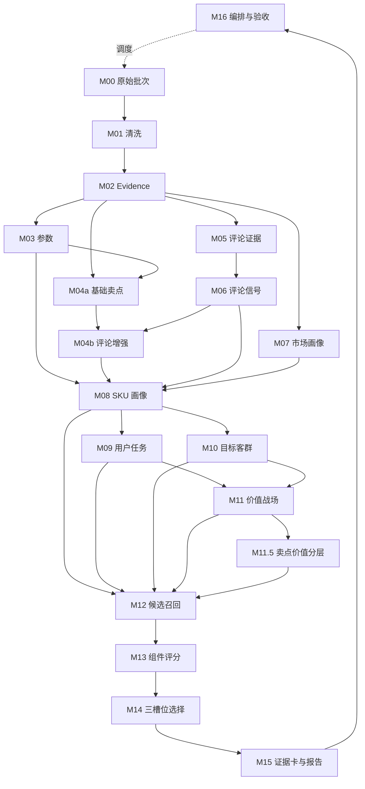

# M16 增量任务编排、复核和验收模块 SOP 需求

## 0. 单模块强化状态

本文件已按“单模块逐一强化”要求完成第一轮强化。M16 是当前 SOP 模块顺序的最后一个模块；下一步不再新增 SOP 模块需求文档，应进入整套需求评审、模块详细设计和开发任务拆分。

## 1. 模块目标

M16 是彩电核心三竞品 MVP 的生产线控制模块，负责把 M00-M15 串成可持续运行、可增量重算、可复核、可验收、可发布的闭环。它不产生业务结论，而是回答五个治理问题：

1. 新增或变化的数据应该触发哪些模块重跑。
2. 每个模块是否按正确依赖顺序执行，是否绕过了上游产物。
3. 哪些结果可以进入高层汇报，哪些只能作为待复核结果。
4. 每次运行处理了哪些数据、哪些 SKU、哪些规则版本和哪些结果版本。
5. 后续原始表继续增加时，如何只处理增量并保留历史可追溯。

M16 的核心要求是“模块化编排”，不是“一个大脚本跑完所有事情”。清洗、证据生成、参数抽取、卖点激活、评论信号、市场画像、SKU 画像、任务、客群、战场、候选召回、评分、选择和报告都必须由各自模块独立产出；M16 只负责调度、依赖、状态、复核和验收。

## 2. 设计依据

本模块依据：

- `cankao/CatForge_竞品生成SOP_详细指导_v1.md` 的 M16 要求。
- `cankao/catforge_sop_md/modules/M16_增量任务编排、复核和验收模块.md`。
- `cankao/CatForge_核心竞品展示页_UI设计规范_v1.md` 中低置信、复核、导出、验收和业务展示约束。
- M00-M15 已强化后的模块需求文档。
- [00 真实样例数据基线](00_real_data_baseline.md)。
- 已确认的数据分层原则：原始表只读，清洗表、证据表、抽取表、画像表、结果表分层保存。
- 当前 205 PostgreSQL 真实样例数据：35 个型号、1326 行周销、2843 行参数、65 行卖点、62426 行评论，品牌均为海信。

## 3. 上游输入

M16 消费全链路模块的状态、版本、hash、复核问题和业务结果摘要。

### 3.1 数据接入和清洗层

| 上游模块 | 输入 | M16 使用方式 |
| --- | --- | --- |
| M00 原始数据批次与行登记 | `core3_source_batch`、`core3_source_row_registry`、`core3_source_impacted_sku` | 确认原始水位、受影响 SKU、受影响模块、原始行变化类型 |
| M01 清洗规范化与质量诊断 | 清洗事实表、`core3_data_quality_issue`、clean hash | 判断清洗是否成功、有效记录是否异常下降、质量问题是否阻断下游 |
| M02 Evidence 原子层 | `core3_evidence_atom`、evidence 状态、证据置信度 | 判断业务结论是否有 evidence、旧 evidence 是否失效、证据覆盖是否足够 |

### 3.2 抽取和画像层

| 上游模块 | 输入 | M16 使用方式 |
| --- | --- | --- |
| M03 参数抽取 | 标准参数、参数冲突、参数复核问题 | 判断参数变化是否触发 M04a/M08-M15 |
| M04a 基础卖点激活 | 基础卖点激活、缺卖点、参数宣传冲突 | 判断卖点缺失或冲突是否进入复核 |
| M05 评论基础证据 | 去重评论、句级评论 evidence、评论质量问题 | 判断评论样本是否有效、重复或默认评价是否过高 |
| M06 评论下游信号 | 评论主题、情绪、场景、痛点、服务边界信号 | 判断评论信号是否可用于 M04b、M08-M11.5 |
| M04b 评论验证增强 | 评论增强卖点、评论冲突、弱感知提示 | 判断卖点感知是否可进入画像和报告 |
| M07 市场画像 | SKU 量价、渠道平台、趋势和价格带画像 | 判断市场变化是否触发候选和评分 |
| M08 SKU 综合信号画像 | `profile_hash`、完整度、风险缺失、证据摘要 | 决定 M09-M15 是否需要重算 |
| M09 用户任务 | 任务候选、任务得分、任务复核问题 | 作为 M10-M12 的依赖和复核来源 |
| M10 目标客群 | 客群候选、客群得分、客群复核问题 | 作为 M11/M12 的依赖和复核来源 |
| M11 价值战场 | 战场候选、主/次/机会战场、战场复核问题 | 决定候选召回和报告语境 |
| M11.5 战场内卖点价值分层 | 战场内卖点层级、价值强弱、复核问题 | 支撑 M12-M15 的卖点价值解释 |

### 3.3 竞品结果和报告层

| 上游模块 | 输入 | M16 使用方式 |
| --- | --- | --- |
| M12 候选池召回 | 候选池、召回理由、候选规模、复核问题 | 判断候选池是否过小、过大或单一来源 |
| M13 组件评分 | 组件分、角色分、证据质量、评分复核问题 | 判断竞品分数是否可用于选择 |
| M14 三槽位核心竞品选择 | 核心三竞品、空槽原因、未选原因、选择复核问题 | 判断是否可发布核心竞品结论 |
| M15 证据卡与高层报告 | 证据卡、报告 payload、导出状态、报告复核问题 | 生成最终验收报告和发布门禁 |

## 4. 下游输出

M16 输出的是生产线治理结果，不输出新的业务分析结论。

| 输出 | 用途 |
| --- | --- |
| `core3_pipeline_run` | 一次全链路或增量运行的总记录 |
| `core3_module_run` | 每个模块的独立运行状态和输入输出统计 |
| `core3_recompute_plan` | 本次应重跑哪些模块、哪些 SKU、为什么重跑 |
| `core3_module_dependency_snapshot` | 记录模块依赖 hash、版本和是否复用旧结果 |
| `core3_review_queue` | 汇总 M00-M15 的待复核问题 |
| `core3_review_decision` | 人工复核处理结果和处理原因 |
| `core3_acceptance_report` | MVP 运行验收结果和质量摘要 |
| `core3_release_gate` | 报告是否可发布、可汇报、可导出 |
| `core3_pipeline_watermark` | 每张原始表、每个模块、每个目标 SKU 的最新处理水位 |

下游使用者：

- 业务页面读取发布后的 M15 报告和 M16 发布状态。
- 运营/数据人员读取 M16 运行状态、复核队列和验收报告。
- 后续开发任务拆分读取 M16 的任务图、状态机和数据契约。

## 5. 本模块不做什么

- 不清洗原始数据。
- 不生成 evidence。
- 不抽取参数、卖点、评论语义、任务、客群或战场。
- 不评分候选、不选择竞品、不生成高层报告正文。
- 不把所有模块逻辑合并成一个脚本。
- 不覆盖历史批次、历史报告或历史复核结论。
- 不自动发布低置信或未复核结果。
- 不绕过 M00-M15 直接读取原始表做业务判断。
- 不把服务体验问题升级为产品核心竞争结论。
- 不把当前 205 样例数据包装成全品牌、全渠道、全市场结论。

## 6. 总体处理流程

M16 的标准流程：

```text
创建 pipeline run
-> 读取上次水位和规则版本
-> 执行或读取 M00 批次登记
-> 计算受影响 SKU、受影响数据域和受影响模块
-> 生成 recompute plan
-> 按模块依赖图逐层执行或复用结果
-> 收集 module run 状态、输出 hash、质量摘要
-> 汇总 M00-M15 复核问题
-> 生成验收报告
-> 计算发布门禁
-> 更新 pipeline watermark
```

每个步骤必须可恢复。某个模块失败时，不删除已经成功的上游结果；下游依赖该模块的任务标记为 `blocked` 或 `skipped_by_failed_dependency`。

## 7. 运行模式

| 模式 | 触发场景 | 处理范围 | 典型用途 |
| --- | --- | --- | --- |
| `bootstrap_full` | 首次接入真实样例数据 | 全量原始表、全量 SKU、全量模块 | 初始化 MVP 基线 |
| `daily_incremental` | 原始表持续新增或修订 | 新增/变化行影响到的 SKU 和模块 | 日常刷新 |
| `ruleset_replay` | 规则、seed、本体或阈值调整 | 受规则影响的模块及下游 | 需求迭代后重算 |
| `single_target_refresh` | 指定目标 SKU 复查 | 指定 SKU 和相关候选池 | 业务演示或问题排查 |
| `review_rework` | 人工复核结论改变 | 被复核对象及下游 | 复核后重新验收 |
| `acceptance_only` | 不重算，只重新验收 | 已有结果 | 发布前检查 |

MVP 首版可以用离线或半在线方式执行，但必须保留上述模式字段，避免后续无法扩展为定时任务或队列任务。

## 8. 模块依赖图



M16 不能改变图中依赖方向。下游模块缺少必要上游产物时，应停止本目标或本模块执行，并输出复核或阻断原因。

## 9. 增量影响扩散规则

### 9.1 原始数据变化影响

| 变化来源 | 首个重算模块 | 必须继续影响 | 可复用模块 |
| --- | --- | --- | --- |
| `week_sales_data` 新增或修订 | M01 市场清洗、M02 市场 evidence | M07-M15 | 参数、卖点、评论抽取若 hash 未变可复用 |
| `attribute_data` 新增或修订 | M01 参数清洗、M02 参数 evidence、M03 | M04a、M08-M15 | 评论基础层可复用 |
| `selling_points_data` 新增或修订 | M01 卖点清洗、M02 卖点 evidence、M04a | M04b、M08-M15 | 市场和评论基础层若 hash 未变可复用 |
| `comment_data` 新增或修订 | M01 评论清洗、M02 评论 evidence、M05 | M06、M04b、M08-M15 | 参数抽取、市场画像若 hash 未变可复用 |
| 原始行失效或消失 | M00-M02 | 依赖该 evidence 的所有下游 | 无法盲目复用，需要按 evidence 状态判断 |

### 9.2 规则和 seed 变化影响

| 变化来源 | 重算范围 |
| --- | --- |
| 参数标准 seed 或参数解析规则变化 | M03-M15 |
| 标准卖点 seed 或卖点激活规则变化 | M04a、M04b、M08-M15 |
| 评论分句、主题、情绪、场景规则变化 | M05、M06、M04b、M08-M15 |
| 市场价格带或渠道平台规则变化 | M07-M15 |
| SKU 画像合并规则变化 | M08-M15 |
| 用户任务 seed 或任务推导规则变化 | M09、M11-M15 |
| 目标客群 seed 或客群推导规则变化 | M10-M15 |
| 价值战场 seed 或战场推导规则变化 | M11-M15 |
| 战场内卖点价值层规则变化 | M11.5-M15 |
| 候选召回规则变化 | M12-M15 |
| 组件评分规则变化 | M13-M15 |
| 三槽位选择规则变化 | M14-M15 |
| 报告展示和语言规则变化 | M15 |
| 验收门禁或复核规则变化 | M16 `acceptance_only` |

### 9.3 受影响目标扩散

SKU 数据变化不只影响自身报告。M16 必须做三层扩散：

1. 直接受影响 SKU：原始行、清洗行或画像 hash 变化的 SKU。
2. 可比池受影响目标：与该 SKU 在尺寸、价格带、渠道平台、主战场或候选池中存在关系的目标 SKU。
3. 发布目标：被业务配置为重点演示、重点监测或已发布报告的目标 SKU。

例如 85E7Q 本身数据未变，但 85E8Q 或 85E5Q-PRO 的市场价格、参数或战场画像变化，可能影响 85E7Q 的候选召回、组件评分、三槽位选择和报告，需要从 M12 或 M13 开始重算 85E7Q 报告。

## 10. 分层执行要求

M16 必须遵守以下分层边界：

| 层 | 包含模块 | 执行要求 |
| --- | --- | --- |
| 原始登记层 | M00 | 只读原始表，建立批次、水位、行 hash、受影响 SKU |
| 清洗规范层 | M01 | 写入清洗表和质量问题表，不覆盖原始表 |
| 证据原子层 | M02 | 写入 evidence，不直接输出业务结论 |
| 抽取特征层 | M03-M06、M04b | 每个抽取模块独立执行、独立状态、独立复核问题 |
| 画像推导层 | M07-M11.5 | 按上游 hash 生成画像和业务语义推导 |
| 竞品结果层 | M12-M15 | 候选、评分、选择和报告逐层生成 |
| 治理验收层 | M16 | 状态、复核、验收、发布门禁 |

下游模块只能读取上游正式产物或上游 snapshot。禁止为了省事直接读取 `week_sales_data`、`attribute_data`、`selling_points_data`、`comment_data` 生成结论。

## 11. 任务计划生成逻辑

### 11.1 输入集合

M16 生成 `core3_recompute_plan` 时至少使用：

- M00 的 `source_impacted_sku`。
- M01-M15 的 output hash。
- 当前 ruleset version、seed version、module version。
- 已发布目标 SKU 列表。
- 已配置的演示目标 SKU，例如 85E7Q。
- 上一次成功运行的 pipeline watermark。
- 上一次发布结果的依赖 snapshot。

### 11.2 计划步骤

1. 读取本次触发类型：数据增量、规则变化、单 SKU 刷新、复核返工或只验收。
2. 计算数据域变化：市场、参数、卖点、评论、主数据、质量 evidence。
3. 将变化映射到首个重算模块。
4. 从首个模块向下游展开依赖图。
5. 对每个目标 SKU 生成模块任务。
6. 对 unchanged 且依赖 hash 完全一致的模块标记为 `skipped_reused`。
7. 对缺上游、质量阻断或复核未完成的模块标记为 `blocked`。
8. 生成可执行任务图和预估输出范围。

### 11.3 任务粒度

MVP 首版支持三种任务粒度：

| 粒度 | 适用模块 | 说明 |
| --- | --- | --- |
| 批次级 | M00-M02 | 按数据批次或原始表域处理 |
| SKU 级 | M03-M11.5 | 按 SKU 画像和业务语义推导 |
| 目标 SKU 级 | M12-M15 | 按目标 SKU 及其候选池处理 |

不建议用“全局一次性任务”覆盖所有模块，否则无法定位错误、复核和增量重算边界。

## 12. 模块运行状态机

### 12.1 状态定义

| 状态 | 含义 | 是否允许发布 |
| --- | --- | --- |
| `pending` | 已计划未执行 | 否 |
| `running` | 正在执行 | 否 |
| `success` | 成功且无阻断问题 | 可继续判断 |
| `warning` | 成功但存在非阻断质量提示 | 可继续判断 |
| `review_required` | 成功但需要人工复核 | 默认不可发布 |
| `blocked` | 缺少必要上游或复核未完成 | 否 |
| `failed` | 执行失败 | 否 |
| `skipped_reused` | 依赖 hash 未变，复用旧结果 | 取决于旧结果状态 |
| `skipped_by_dependency` | 上游失败或阻断导致跳过 | 否 |
| `released` | 已通过发布门禁 | 是 |
| `deprecated` | 被新版本替代 | 否 |

### 12.2 状态流转

```text
pending -> running -> success
pending -> running -> warning
pending -> running -> review_required
pending -> running -> failed
pending -> blocked
pending -> skipped_reused
pending -> skipped_by_dependency
success/warning -> released
success/warning/review_required -> deprecated
review_required -> success/warning after approved
review_required -> blocked after rejected
```

人工复核只能改变复核对象和发布门禁，不能直接篡改上游模块输出事实。若复核改变业务规则或事实解释，应触发 `review_rework` 重算。

## 13. 数据契约

### 13.1 `core3_pipeline_run`

记录一次生产线运行。

| 字段 | 说明 |
| --- | --- |
| `run_id` | 运行编号 |
| `project_id` | 项目编号 |
| `category_code` | 品类，彩电为 `TV` |
| `run_mode` | bootstrap_full/daily_incremental/ruleset_replay/single_target_refresh/review_rework/acceptance_only |
| `trigger_type` | data_change/rule_change/manual/review/export_acceptance |
| `triggered_by` | 触发人或任务 |
| `data_batch_id` | M00 批次 |
| `target_scope_json` | 本次目标范围 |
| `ruleset_version` | 总规则版本 |
| `module_version_json` | M00-M16 模块版本 |
| `seed_version_json` | 参数、卖点、任务、客群、战场等 seed 版本 |
| `input_watermark_json` | 每张原始表输入水位 |
| `status` | 总状态 |
| `started_at` | 开始时间 |
| `finished_at` | 结束时间 |
| `output_summary_json` | 输出数量摘要 |
| `quality_summary_json` | 质量摘要 |
| `release_status` | not_ready/review_required/releasable/released |

### 13.2 `core3_recompute_plan`

记录本次为什么重跑。

| 字段 | 说明 |
| --- | --- |
| `plan_id` | 计划编号 |
| `run_id` | 运行编号 |
| `module_code` | 模块编号 |
| `target_type` | batch/sku/target_sku |
| `target_id` | 批次、SKU 或目标 SKU |
| `start_from_module` | 变化应从哪个模块开始 |
| `change_domain` | market/param/claim/comment/profile/rule/review/report |
| `change_reason` | 触发原因中文说明 |
| `upstream_dependency_hash` | 上游依赖 hash |
| `previous_output_hash` | 上次输出 hash |
| `planned_action` | run/reuse/block/skip |
| `priority` | normal/high/demo |
| `created_at` | 生成时间 |

### 13.3 `core3_module_run`

记录每个模块的独立运行。

| 字段 | 说明 |
| --- | --- |
| `module_run_id` | 模块运行编号 |
| `run_id` | 生产线运行编号 |
| `module_code` | M00-M16 |
| `module_name_cn` | 中文模块名 |
| `target_type` | batch/sku/target_sku |
| `target_id` | 处理对象 |
| `status` | 模块状态 |
| `input_count` | 输入记录数 |
| `changed_input_count` | 变化输入数 |
| `output_count` | 输出记录数 |
| `warning_count` | 警告数 |
| `review_issue_count` | 复核问题数 |
| `dependency_hash` | 依赖 hash |
| `output_hash` | 输出 hash |
| `reused_from_module_run_id` | 复用的历史模块运行 |
| `error_code` | 错误编码 |
| `error_message_cn` | 中文错误说明 |
| `started_at` | 开始时间 |
| `finished_at` | 结束时间 |

### 13.4 `core3_module_dependency_snapshot`

记录下游结果依赖了哪些上游版本。

| 字段 | 说明 |
| --- | --- |
| `snapshot_id` | 快照编号 |
| `run_id` | 运行编号 |
| `module_code` | 当前模块 |
| `target_id` | 处理对象 |
| `upstream_module_code` | 上游模块 |
| `upstream_output_hash` | 上游输出 hash |
| `upstream_rule_version` | 上游规则版本 |
| `upstream_module_run_id` | 上游运行编号 |
| `dependency_status` | current/reused/missing/invalid |

### 13.5 `core3_review_queue`

汇总 M00-M15 的复核问题，供人工处理。

| 字段 | 说明 |
| --- | --- |
| `review_id` | 复核编号 |
| `run_id` | 运行编号 |
| `module_code` | 来源模块 |
| `target_type` | batch/sku/target_sku/candidate/report |
| `target_id` | 复核对象 |
| `issue_type` | 问题类型 |
| `severity` | blocker/high/medium/low |
| `issue_title_cn` | 中文问题标题 |
| `issue_detail_cn` | 中文问题说明 |
| `evidence_ids` | 相关 evidence |
| `source_module_run_id` | 来源模块运行 |
| `suggested_action_cn` | 建议动作 |
| `review_status` | pending/approved/rejected/waived/resolved |
| `reviewer` | 复核人 |
| `reviewed_at` | 复核时间 |

### 13.6 `core3_review_decision`

记录人工复核动作。

| 字段 | 说明 |
| --- | --- |
| `decision_id` | 决策编号 |
| `review_id` | 复核编号 |
| `decision_type` | approve/reject/waive/request_data/rework_rule |
| `decision_reason_cn` | 中文原因 |
| `impact_scope_json` | 影响范围 |
| `need_recompute` | 是否需要重算 |
| `decided_by` | 处理人 |
| `decided_at` | 处理时间 |

### 13.7 `core3_acceptance_report`

记录一次运行是否达到 MVP 可用标准。

| 字段 | 说明 |
| --- | --- |
| `acceptance_id` | 验收编号 |
| `run_id` | 运行编号 |
| `data_batch_id` | 数据批次 |
| `processed_sku_count` | 已处理 SKU 数 |
| `processed_target_count` | 已处理目标 SKU 数 |
| `report_ready_count` | 报告可用数量 |
| `high_confidence_report_count` | 高置信报告数量 |
| `medium_confidence_report_count` | 中置信报告数量 |
| `limited_report_count` | 数据受限但可说明数量 |
| `blocked_report_count` | 阻断数量 |
| `avg_competitor_count` | 平均核心竞品数量 |
| `direct_slot_fill_rate` | 正面对打槽位填充率 |
| `pressure_slot_fill_rate` | 价格/销量压力槽位填充率 |
| `benchmark_slot_fill_rate` | 高端标杆槽位填充率 |
| `evidence_coverage_rate` | 证据覆盖率 |
| `review_pending_count` | 待复核数量 |
| `blocker_count` | 阻断问题数量 |
| `acceptance_status` | passed/passed_with_warning/failed |
| `acceptance_summary_cn` | 中文验收摘要 |

### 13.8 `core3_release_gate`

记录报告发布门禁。

| 字段 | 说明 |
| --- | --- |
| `release_gate_id` | 门禁编号 |
| `run_id` | 运行编号 |
| `target_sku_code` | 目标 SKU |
| `report_payload_id` | M15 报告 payload |
| `selection_run_id` | M14 选择运行 |
| `gate_status` | blocked/review_required/releasable/released |
| `gate_reason_cn` | 中文原因 |
| `required_review_ids` | 必须处理的复核问题 |
| `warning_review_ids` | 可带说明发布的问题 |
| `data_scope_note_cn` | 数据范围说明 |
| `released_by` | 发布人 |
| `released_at` | 发布时间 |

### 13.9 `core3_pipeline_watermark`

记录增量水位。

| 字段 | 说明 |
| --- | --- |
| `watermark_id` | 水位编号 |
| `project_id` | 项目 |
| `category_code` | 品类 |
| `source_table` | 原始表 |
| `last_source_pk` | 已处理最大来源主键 |
| `last_write_time` | 已处理最大写入时间 |
| `last_row_hash_snapshot` | 行 hash 快照编号 |
| `last_success_run_id` | 上次成功运行 |
| `updated_at` | 更新时间 |

## 14. 复核触发规则

M16 接收各模块的复核问题，并追加跨模块复核判断。

### 14.1 数据质量复核

| 场景 | 级别 | 处理 |
| --- | --- | --- |
| 原始表新增但 M01 有效 SKU 数异常下降 | blocker | 阻断发布，检查清洗规则和原始上传 |
| 关键字段缺失率异常升高 | high | 进入复核，必要时阻断受影响目标 |
| `model_code` 缺失或跨表冲突 | high | 不能生成可信 SKU 结果 |
| 参数 unknown 比例过高 | medium | 降低相关参数和卖点置信度 |
| 结构化卖点覆盖缺失 | medium | 不阻断，但报告必须说明 |
| 评论重复、默认评价或空维度过高 | medium | 评论信号降权 |
| 原始表只有线上渠道 | low | 报告必须注明不能做线下判断 |

### 14.2 业务推导复核

| 场景 | 来源 | 级别 | 处理 |
| --- | --- | --- | --- |
| 参数和宣传卖点冲突 | M03/M04a | high | 阻断相关卖点高置信输出 |
| 评论信号只来自服务体验 | M06/M04b | medium | 不得支撑产品核心竞争结论 |
| 任务、客群或战场靠单一证据来源 | M09-M11 | medium | 降低置信度并提示复核 |
| 候选池少于 3 个 | M12 | high | 不能硬凑核心三竞品 |
| 候选池过大且同质化 | M12 | medium | 需要去重和未选原因 |
| 组件分接近阈值 | M13 | medium | 三槽位选择需提示 |
| 三槽位未选满 | M14 | high 或 medium | 有合理空槽原因可带说明发布 |
| 证据卡必要域缺失 | M15 | high | 阻断对应竞品卡发布 |
| 主屏出现内部字段或 UUID | M15 | blocker | 阻断发布 |

### 14.3 版本和运行复核

| 场景 | 级别 | 处理 |
| --- | --- | --- |
| 下游 output hash 变化但上游 dependency hash 未记录 | blocker | 阻断发布 |
| 同一 target 同规则版本重复发布不同结果 | blocker | 检查版本和幂等性 |
| 模块直接读取原始表绕过上游 | blocker | 阻断验收 |
| 复用旧结果但上游规则版本已变 | blocker | 强制重算 |
| 历史报告被覆盖而非新版本保存 | blocker | 阻断验收 |

## 15. 发布门禁规则

### 15.1 可发布条件

目标 SKU 报告进入 `releasable` 至少满足：

1. M00-M15 必要模块均为 `success`、`warning` 或合法 `skipped_reused`。
2. 没有 blocker 级复核问题。
3. high 级复核问题已处理，或被明确降级并记录原因。
4. M14 至少有 1 个可解释核心竞品；若不足 3 个，M15 必须有空槽原因。
5. 每个入选竞品有证据卡。
6. 证据卡有可追溯 evidence_ids。
7. 报告首屏不出现内部英文枚举、表名、字段名或 UUID。
8. 数据范围和限制说明完整。
9. 当前样例数据不冒充全品牌、全渠道、全市场结论。

### 15.2 允许带说明发布

以下情况可以 `passed_with_warning`，但必须在 M15 报告和 M16 门禁中说明：

- 当前只有海信品牌，因此竞品是海信内部型号之间的核心竞争关系。
- 当前只有线上渠道，不能输出线下竞争判断。
- 85E7Q 没有结构化卖点，只能用参数、市场和评论进行降级证明。
- 评论数据有重复和维度拆行，评论证据仅作为感知支撑。
- 样例数据尚未覆盖完整市场，结论用于 MVP 验证。

### 15.3 必须阻断发布

以下情况必须 `blocked`：

- 报告没有任何核心竞品且没有合理样本限制说明。
- 核心竞品没有 evidence。
- 报告结论和 M14 选择结果不一致。
- 报告把 low confidence 写成确定结论。
- 报告出现 UUID、SQL、内部字段、模型过程或 AI 炫技话术。
- 关键上游模块失败但 M15 仍然生成正式报告。
- 原始表被清洗流程覆盖或改写。

## 16. 验收报告逻辑

M16 生成的验收报告分为四层：

### 16.1 数据接入验收

验证：

- 四张原始表只读。
- M00 有批次、水位、行 hash 和受影响 SKU。
- M01 有清洗结果和质量诊断。
- M02 有 evidence 原子。
- 本次处理行数、SKU 数和上次水位一致。

### 16.2 模块链路验收

验证：

- M00-M15 依赖方向正确。
- 每个模块都有独立运行状态。
- 每个下游结果记录依赖 hash 和规则版本。
- 未变化模块可复用，变化模块必须重算。
- 失败或阻断能传递给下游。

### 16.3 业务输出验收

验证：

- M12 候选池存在且有召回理由。
- M13 评分有组件证据。
- M14 三槽位选择有角色、空槽和未选原因。
- M15 报告先说竞品，再解释原因。
- 低置信和样本不足不被隐藏。

### 16.4 高层展示验收

验证：

- 30 秒内能看懂目标 SKU 的核心竞品是谁、代表什么压力、为什么选择。
- 主屏是中文业务语言。
- 不出现内部字段、UUID、SQL、JSON 和模型过程。
- 每个竞品有策略含义。
- 候选池和未选原因可展开。
- 数据版本、样本限制和复核状态清楚。

## 17. 面向 205 样例数据的要求

当前 205 样例数据是可做 MVP 分析的真实样例，但不能按完整市场使用。M16 必须在验收和发布门禁中固定识别以下事实：

| 数据事实 | M16 处理要求 |
| --- | --- |
| 35 个量价型号，品牌均为海信 | 不按品牌内外部过滤，海信型号可以互为竞品 |
| 周销为 26W01-26W23，线上渠道 | 可做线上价格、销量、平台判断，不能做线下判断 |
| 平台只有专业电商、平台电商 | 渠道重合首版基于平台，不扩展到线下门店 |
| 参数 2843 行但 unknown/空值/`-` 较多 | 参数缺失要降低置信度，不当 false |
| 卖点 65 行只覆盖 5 个型号 | 卖点缺失是数据覆盖问题，不等于 SKU 没有卖点 |
| 85E7Q 无结构化卖点 | 85E7Q 报告必须显示卖点证据缺口 |
| 评论 62426 行但存在重复和拆行 | 评论要以去重和句级 evidence 为基础 |
| 评论服务类内容较多 | 服务体验不能替代产品核心竞争证明 |

对于 85E7Q，M16 的发布门禁必须确认：

- 目标 SKU `TV00029115` 的市场、参数、评论覆盖正常。
- 结构化卖点缺失已在 M04a/M04b/M08/M15 中体现。
- 候选竞品可以是其他海信 85 吋或相近战场型号。
- 不因为同品牌而排除候选。
- 若只能选出 1-2 个高置信竞品，必须有空槽原因。

## 18. 异常处理和恢复

| 异常 | 处理 |
| --- | --- |
| M00 扫描失败 | pipeline run 失败，不启动下游 |
| M01 清洗失败 | M02-M15 标记 `skipped_by_dependency` |
| M02 evidence 失败 | 业务模块全部阻断 |
| 单个 SKU 抽取失败 | 仅阻断该 SKU 和受其影响目标 |
| 单个目标报告失败 | 不阻断其他目标报告 |
| 模块运行超时 | 标记 failed，允许按模块重试 |
| 复核队列写入失败 | 阻断发布，避免低置信结果漏审 |
| 导出失败 | 不影响分析结果，但发布状态不能标记为完整 released |

重试要求：

- 重试必须复用同一 `run_id` 或记录 `parent_run_id`。
- 重试不能删除上一轮失败记录。
- 重试成功后，验收报告需要说明哪些模块重试过。

## 19. 幂等和版本管理

M16 必须保证同一输入、同一规则版本、同一 seed 版本下重复运行得到同一 output hash。

版本要求：

- 原始行变化用 M00 `row_hash`。
- 清洗变化用 M01 `clean_hash`。
- evidence 变化用 M02 `evidence_version` 和 evidence 状态。
- 画像变化用 M08 `profile_hash`。
- 业务模块变化用模块自己的 output hash。
- 竞品和报告结果用 `selection_run_id`、`report_payload_id`、`rule_version` 区分。

历史保留原则：

- 不物理删除历史结果。
- 不覆盖已发布报告。
- 新结果用新版本标记 current。
- 旧结果标记 `deprecated` 或 `superseded`。
- 复核决定保留原始处理记录。

## 20. 面向页面和运营后台的展示要求

M16 可以支持一个运营视角的“生产线状态”页面，但不应混入 M15 高层报告主屏。

运营页面可展示：

- 数据批次和处理时间。
- 各模块运行状态。
- 受影响 SKU 数。
- 报告可发布数量。
- 待复核数量。
- 阻断原因。
- 数据范围说明。

业务高层页面只展示：

- 报告是否可汇报。
- 数据版本和更新时间。
- 重要限制说明。
- 需复核提示。

高层页面不得展示完整 M00-M16、内部表名、运行日志、异常堆栈或任务队列细节。

## 21. 质量规则

| 规则 | 要求 |
| --- | --- |
| 模块独立 | M00-M15 每个模块有独立运行记录 |
| 依赖清楚 | 每个下游结果记录上游 hash 和版本 |
| 增量准确 | 只重算受影响范围，不漏算相关候选池 |
| 原始只读 | 不覆盖、删除或清洗原始表 |
| 分层保存 | 清洗、证据、抽取、画像、结果分层落表 |
| 失败可恢复 | 上游成功结果可复用，下游失败可重试 |
| 复核不丢 | 低置信、冲突、样本不足必须进队列 |
| 发布有门禁 | 未通过门禁不能作为正式报告发布 |
| 样本限制可见 | 当前样例数据限制必须出现在验收和报告中 |
| 历史可追溯 | 任意发布报告能追溯到 run、batch、rule、evidence |

## 22. 与其他模块关系

| 模块 | M16 调度责任 | M16 验收责任 |
| --- | --- | --- |
| M00 | 启动批次登记，读取水位 | 批次、行 hash、受影响 SKU 完整 |
| M01 | 按 M00 变化执行清洗 | 清洗表完整，质量问题可追溯 |
| M02 | 按清洗变化生成 evidence | 所有业务结论可引用 evidence |
| M03 | 参数变化或规则变化时执行 | unknown 与 false 分离，冲突进复核 |
| M04a | 卖点或参数变化时执行 | 缺卖点和参数宣传冲突可解释 |
| M05 | 评论变化时执行 | 去重和句级 evidence 可追溯 |
| M06 | 评论基础变化时执行 | 服务边界、场景、痛点可区分 |
| M04b | 卖点或评论信号变化时执行 | 评论增强不能越权生成高置信卖点 |
| M07 | 市场变化时执行 | 线上平台口径清楚 |
| M08 | 抽取和市场画像变化时执行 | profile hash 可驱动下游 |
| M09 | 画像或任务规则变化时执行 | 任务不是直接从评论标签生成 |
| M10 | 画像或客群规则变化时执行 | 客群有多源证据和复核状态 |
| M11 | 画像、任务、客群或战场规则变化时执行 | 主战场/次战场/机会战场可解释 |
| M11.5 | 战场或卖点层变化时执行 | 战场内卖点价值分层可解释 |
| M12 | 画像、任务、客群、战场变化时执行 | 候选池规模、来源和未进入原因可审计 |
| M13 | 候选池或组件规则变化时执行 | 组件分可追溯，不等同最终选择 |
| M14 | 评分或选择规则变化时执行 | 0-3 个核心竞品、空槽原因、未选原因完整 |
| M15 | 选择或报告规则变化时执行 | 高层报告中文业务化、证据完整、低置信提示 |

## 23. 验收标准

| 验收项 | 标准 |
| --- | --- |
| M16 不生成业务结论 | 必须 |
| 不使用一个大脚本替代模块化编排 | 必须 |
| 原始表只读 | 必须 |
| 清洗表、证据表、抽取表、画像表、结果表分层保存 | 必须 |
| 支持 bootstrap_full 和 daily_incremental | 必须 |
| 支持规则版本重跑 | 必须 |
| 每个模块有独立 `core3_module_run` | 必须 |
| 每个下游结果有依赖 hash | 必须 |
| 上游变化能准确扩散到下游 | 必须 |
| 候选 SKU 变化能影响相关目标 SKU 报告 | 必须 |
| 复核队列汇总 M00-M15 问题 | 必须 |
| blocker 问题阻断发布 | 必须 |
| 低置信和样本不足可带说明发布 | 必须 |
| 205 样例数据限制被识别 | 必须 |
| 85E7Q 卖点缺失被纳入门禁说明 | 必须 |
| 高层报告无内部字段、UUID 和 AI 过程文案 | 必须 |
| 验收报告能区分 passed、passed_with_warning、failed | 必须 |
| 历史结果不覆盖，版本可追溯 | 必须 |
| 单目标刷新可运行 | 必须 |
| 批量目标运行可统计可发布数量 | 推荐 |

## 24. 完成 M16 后的下一阶段

M00-M16 模块需求文档完成后，后续不应直接进入代码开发。建议进入三个阶段：

1. 需求评审：逐个模块确认目标、输入、输出、复核规则和验收标准是否符合业务方法论。
2. 详细设计：按模块拆数据库表、API、服务、任务 runner、前端展示和测试方案。
3. 开发任务拆分：按数据底座、抽取画像、竞品推导、报告展示、任务编排五条线排期实现。

M16 在详细设计阶段应重点拆分为任务编排服务、增量影响分析服务、复核队列服务、验收报告服务和发布门禁服务，而不是落成一个单文件脚本。
